# La interfaz el 2026-09-27

107 capturas del paquete de prensa (`tools/graphics/press-kit.mjs`), móvil de 390 × 844 puntos, valle 7 en el año 50 salvo donde el pie diga otra cosa. Guardadas con `tools/graphics/press-archive.py`; cómo se hace una versión nueva, en [`../README.md`](../README.md).

## Sólo interfaz (43)

Copia en [`ui/`](ui/) de las que enseñan una pieza de pantalla: menús, paneles, hojas, botones. Las del banco de batallas son de taller, no del producto final.

| # | Captura | Qué enseña |
|---|---|---|
| 1 | <a href="ui/001-carga.jpg">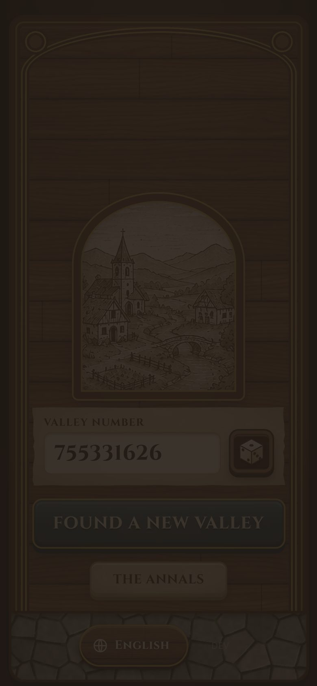</a> | **carga** · La carga del juego, antes de que salga el menú |
| 2 | <a href="ui/002-menu.jpg">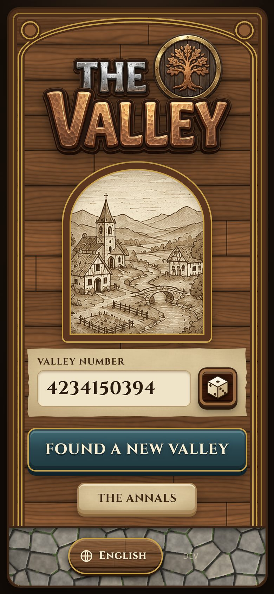</a> | **menu** · El menú de inicio, como lo ve quien abre el juego |
| 3 |  | **menu-taller** · El menú con el interruptor de taller abierto: el año |
| 4 | <a href="ui/004-annals-archivo.jpg">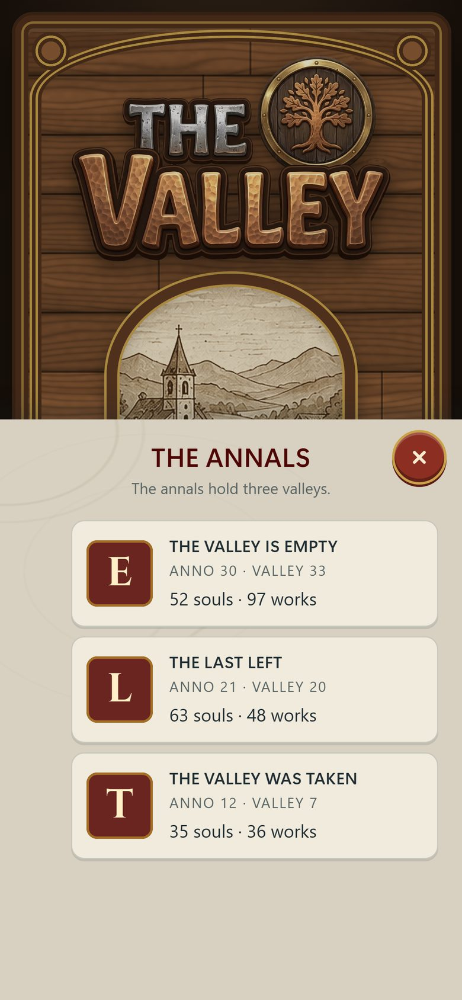</a> | **annals-archivo** · El cronicón con tres valles archivados |
| 5 | <a href="ui/005-annals-vacio.jpg">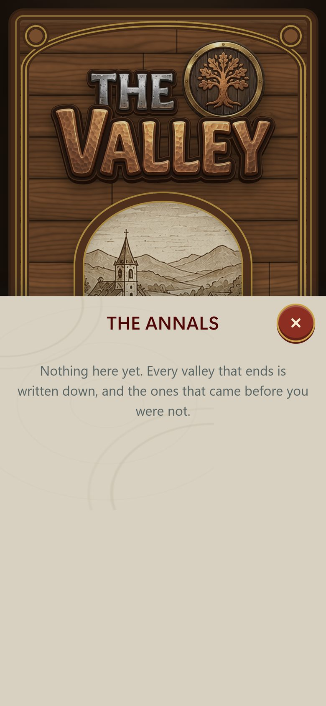</a> | **annals-vacio** · El cronicón antes de guardar una partida |
| 7 |  | **valle** · El valle de tarde, con la interfaz entera |
| 8 | <a href="ui/008-valle-regleta.jpg">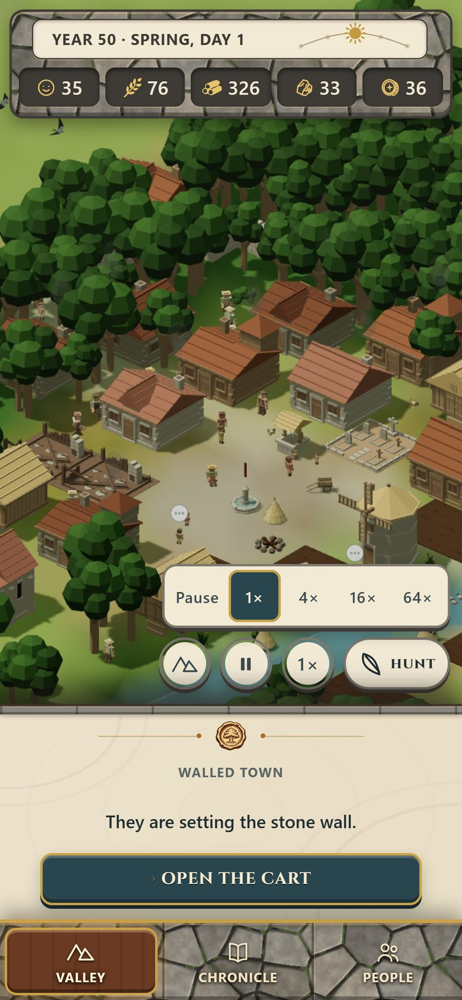</a> | **valle-regleta** · La regleta de velocidad desplegada |
| 9 |  | **valle-pausa** · En pausa: el círculo cambia a ▶ |
| 10 | <a href="ui/010-valle-despejado.jpg">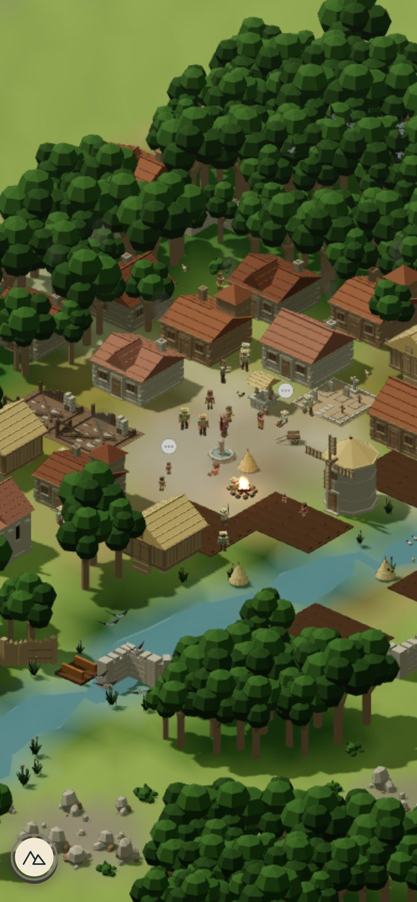</a> | **valle-despejado** · La pantalla despejada: sólo el valle y dos botones |
| 16 |  | **cronica** · La crónica, cubriendo la pantalla |
| 17 | <a href="ui/017-cronica-leyendo.jpg">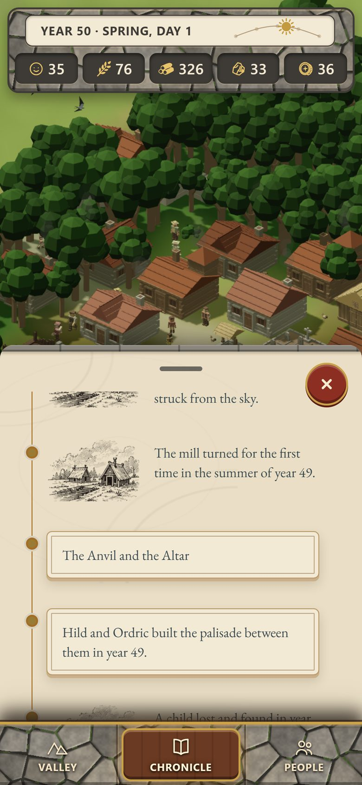</a> | **cronica-leyendo** · La crónica, leída hacia abajo |
| 18 | <a href="ui/018-sello-cronica.jpg">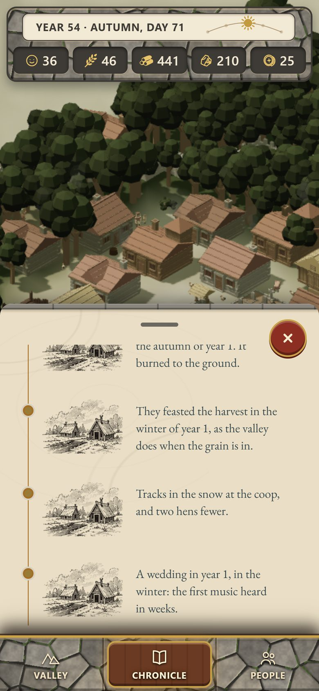</a> | **sello-cronica** · El documento sellado, al final de la crónica |
| 19 |  | **gente** · La gente del valle, los nombrados |
| 20 |  | **ficha-desde-lista** · La ficha abierta desde la lista: con «back to the list» |
| 21 | <a href="ui/021-ficha-siguiendo.jpg">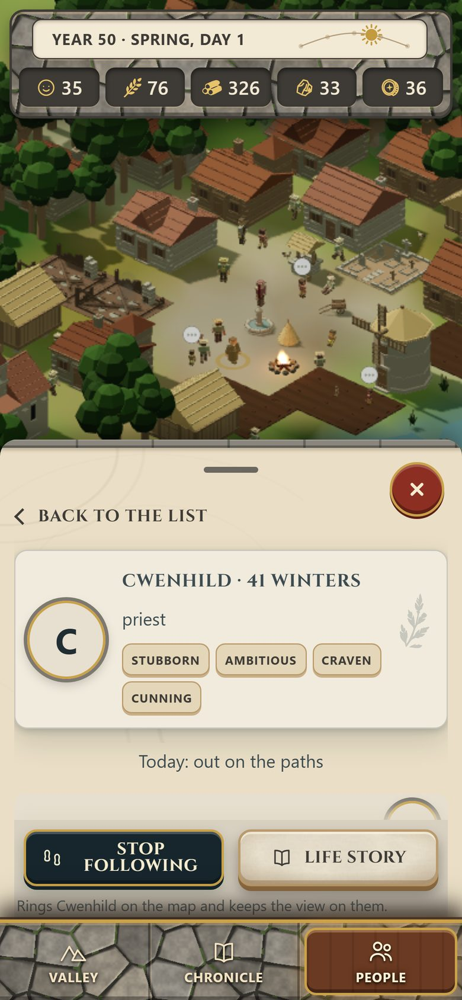</a> | **ficha-siguiendo** · Siguiendo a alguien: la ficha baja y la cámara va detrás |
| 22 |  | **ficha-vida** · La vida de esa persona, desplegada |
| 23 | <a href="ui/023-ficha-vida-final.jpg">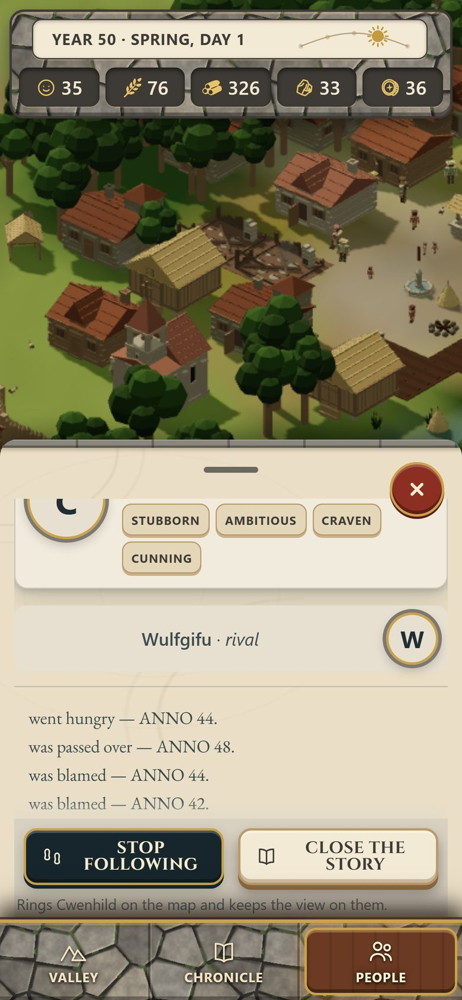</a> | **ficha-vida-final** · Últimos recuerdos con acciones todavía accesibles |
| 24 | <a href="ui/024-carro.jpg">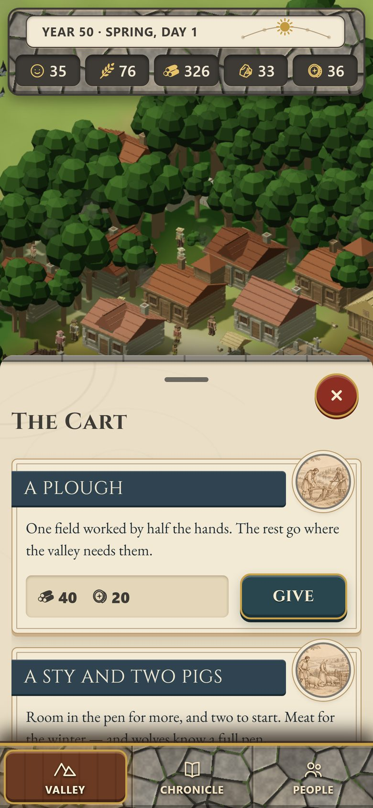</a> | **carro** · El carro: lo que se le puede dar al valle y lo que cuesta |
| 25 | <a href="ui/025-carro-dado.jpg">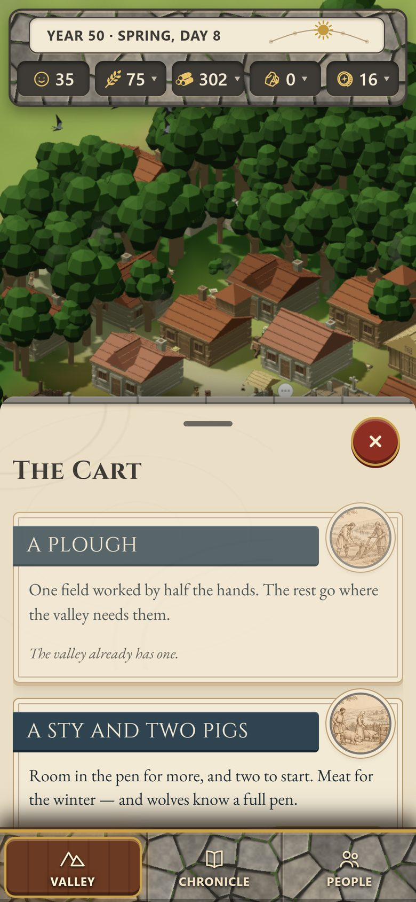</a> | **carro-dado** · Después de dar algo |
| 26 |  | **encrucijada** · Una decisión, planteada |
| 27 |  | **decision-aplazada** · La decisión aplazada: el sello de lacre en la bandeja |
| 28 | <a href="ui/028-sello.jpg">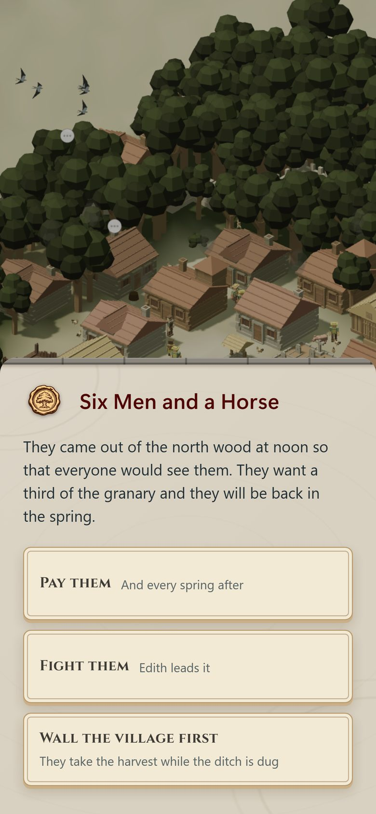</a> | **sello** · Una decisión sin contestar: el sello de lacre en la bandeja |
| 29 | <a href="ui/029-oferta.jpg">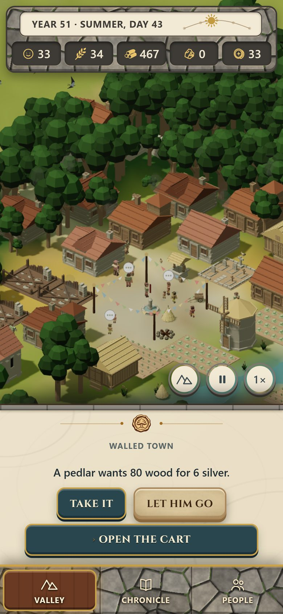</a> | **oferta** · Alguien espera respuesta en el camino: los dos toques de la oferta |
| 30 |  | **corona-lista** · La corona, cuando el valle ya puede coronar a alguien |
| 31 |  | **corona-puesta** · Con un herrero coronado: la sala y el estilo del valle |
| 32 |  | **tocar-1** · Tocando el valle: Stone House |
| 33 | <a href="ui/033-tocar-3.jpg">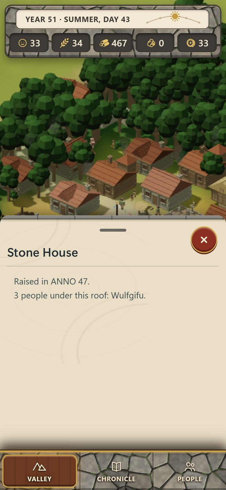</a> | **tocar-3** · Tocando el valle: Stone House |
| 34 |  | **bienvenida** · El parte de bienvenida: lo que pasó mientras no estabas |
| 35 | <a href="ui/035-caza-boton.jpg">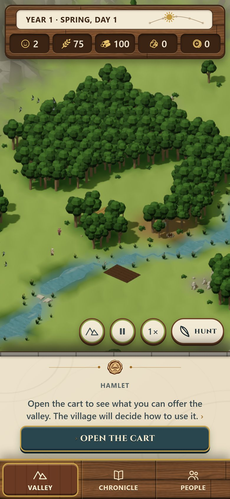</a> | **caza-boton** · Hay presa cerca: el botón de caza |
| 36 | <a href="ui/036-caza-arma.jpg">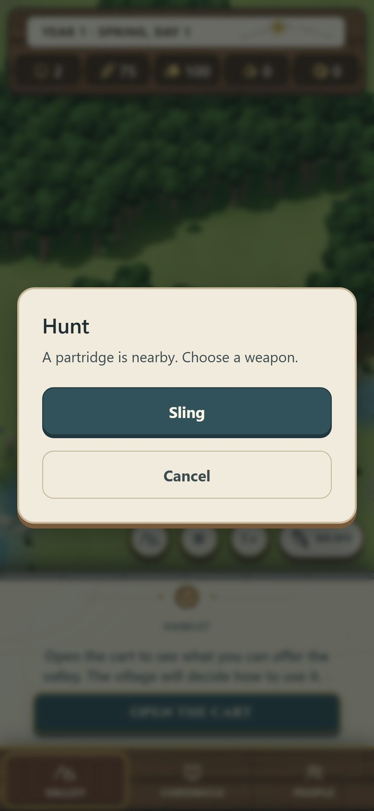</a> | **caza-arma** · La caza: elegir con qué |
| 37 | <a href="ui/037-caza-apuntando.jpg">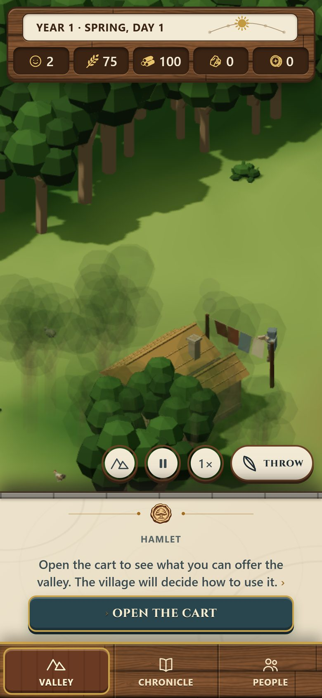</a> | **caza-apuntando** · La caza: apuntando |
| 38 | <a href="ui/038-caza-encuentro.jpg">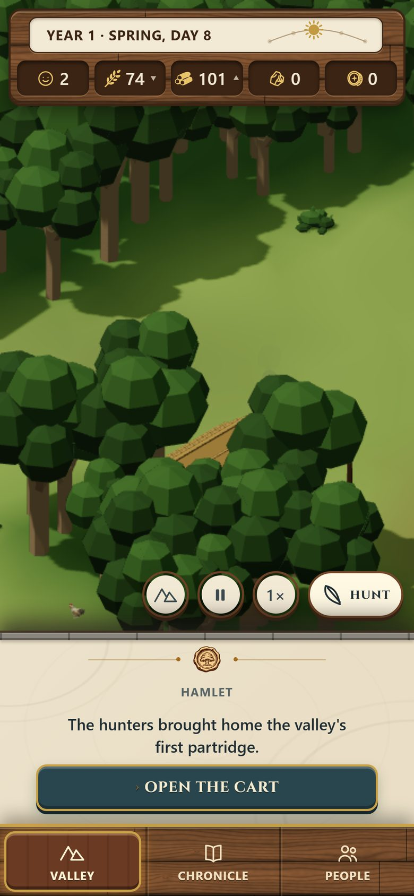</a> | **caza-encuentro** · La caza: el encuentro |
| 43 |  | **amenaza-aviso** · La crónica avisa: un clan vecino se acerca |
| 44 | <a href="ui/044-amenaza-pendiente.jpg">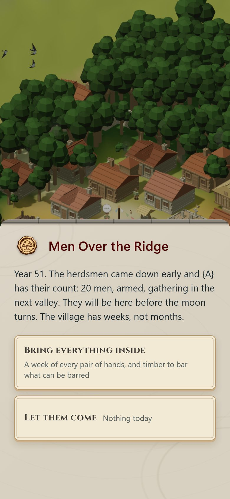</a> | **amenaza-pendiente** · El aviso sin leer todavía |
| 60 |  | **final-stormed-transicion** · El final (valle tomado): el instante antes de la hoja |
| 61 |  | **lapida-stormed** · El valle tomado: la lápida y su inscripción |
| 62 |  | **lapida-extinction** · El valle vacío: no queda nadie: la lápida y su inscripción |
| 63 |  | **lapida-abandoned** · El valle abandonado: la lápida y su inscripción |
| 64 |  | **lapida-dispersed** · El valle disperso: la lápida y su inscripción |
| 65 |  | **final-stormed-cuentas-abajo** · El final (stormed): el resto de las cuentas |
| 104 |  | **banco-cargando** · El banco de batallas: «preparando la villa» |
| 105 |  | **banco** · El banco de batallas con su panel |
| 106 |  | **banco-panel-otro** · El banco de batallas con el panel del otro modo (plegado o desplegado) |

## Todas (107)

| # | Captura | Qué enseña |
|---|---|---|
| 1 |  | **carga** · La carga del juego, antes de que salga el menú |
| 2 |  | **menu** · El menú de inicio, como lo ve quien abre el juego |
| 3 | <a href="003-menu-taller.jpg">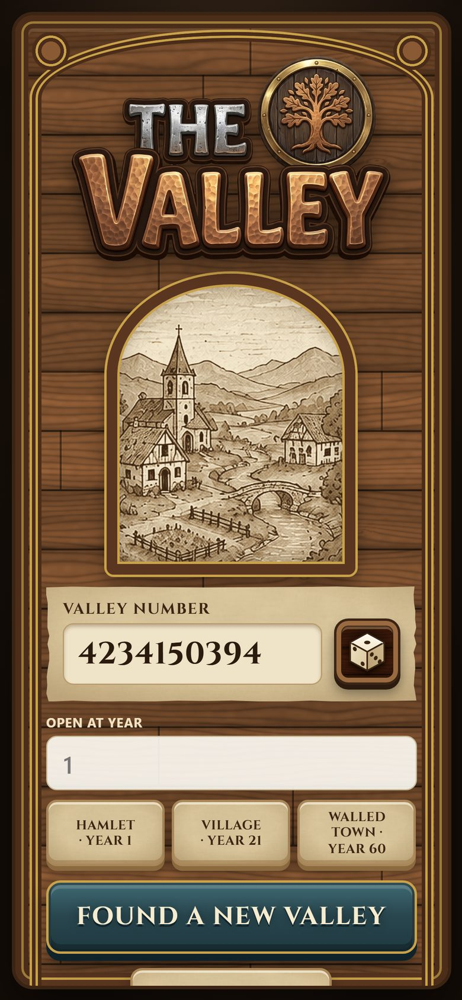</a> | **menu-taller** · El menú con el interruptor de taller abierto: el año |
| 4 |  | **annals-archivo** · El cronicón con tres valles archivados |
| 5 |  | **annals-vacio** · El cronicón antes de guardar una partida |
| 6 | <a href="006-fundando-0.jpg">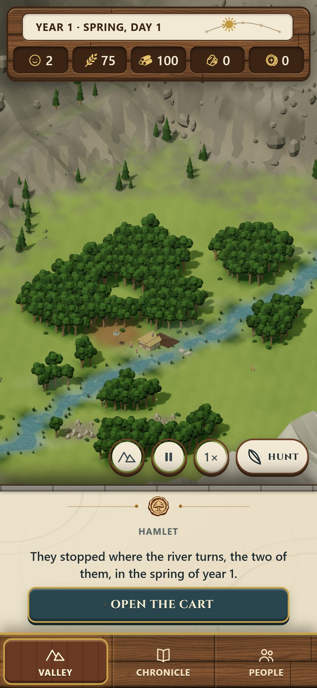</a> | **fundando-0** · Tras tocar «nuevo valle»: el primer instante |
| 7 |  | **valle** · El valle de tarde, con la interfaz entera |
| 8 |  | **valle-regleta** · La regleta de velocidad desplegada |
| 9 | <a href="009-valle-pausa.jpg">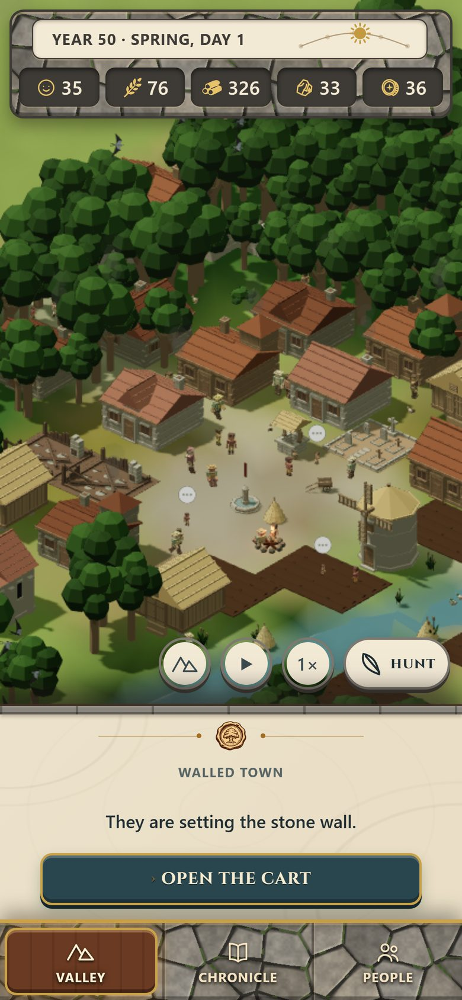</a> | **valle-pausa** · En pausa: el círculo cambia a ▶ |
| 10 |  | **valle-despejado** · La pantalla despejada: sólo el valle y dos botones |
| 11 | <a href="011-valle-cerca.jpg">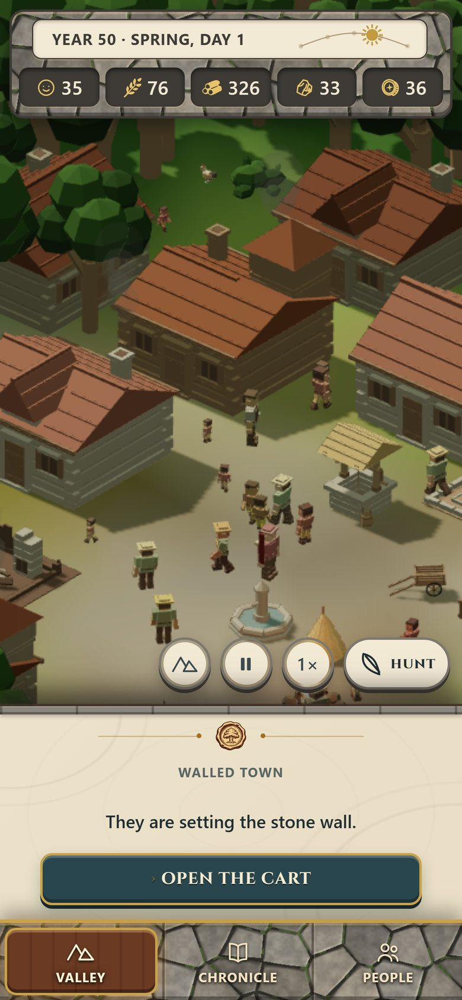</a> | **valle-cerca** · De cerca, a rueda: la aldea a tamaño de cuerpo |
| 12 | <a href="012-hora-tarde.jpg">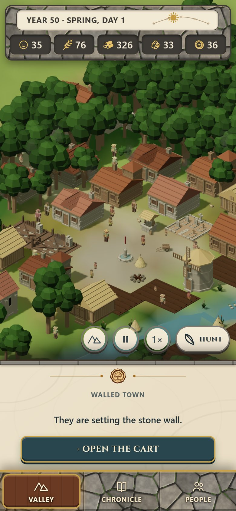</a> | **hora-tarde** · La tarde |
| 13 | <a href="013-hora-anochecer.jpg">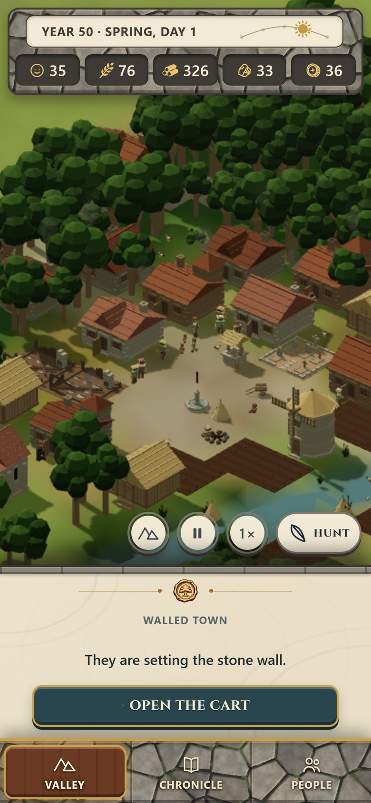</a> | **hora-anochecer** · El anochecer |
| 14 | <a href="014-hora-noche.jpg">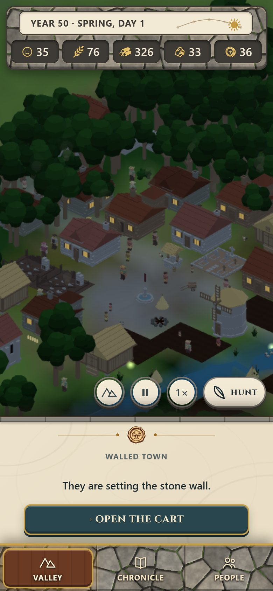</a> | **hora-noche** · La noche cerrada, con las ventanas encendidas |
| 15 | <a href="015-hora-madrugada.jpg">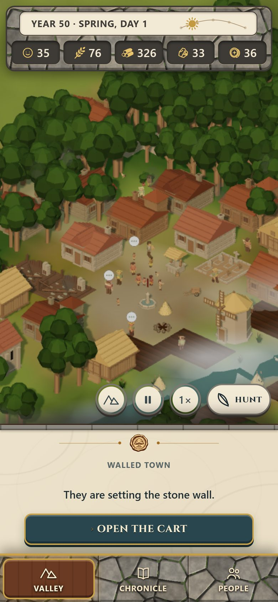</a> | **hora-madrugada** · La madrugada |
| 16 | <a href="016-cronica.jpg">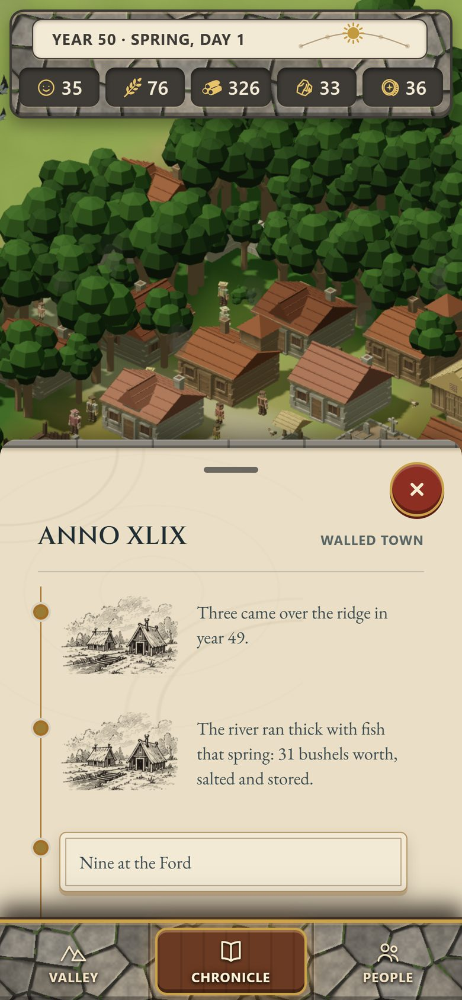</a> | **cronica** · La crónica, cubriendo la pantalla |
| 17 |  | **cronica-leyendo** · La crónica, leída hacia abajo |
| 18 |  | **sello-cronica** · El documento sellado, al final de la crónica |
| 19 | <a href="019-gente.jpg">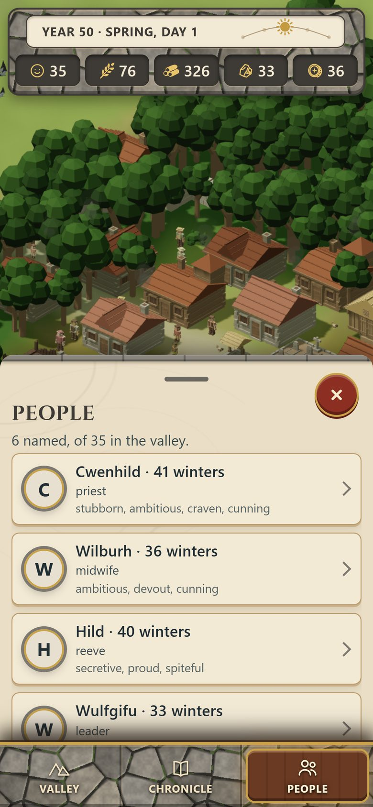</a> | **gente** · La gente del valle, los nombrados |
| 20 | <a href="020-ficha-desde-lista.jpg">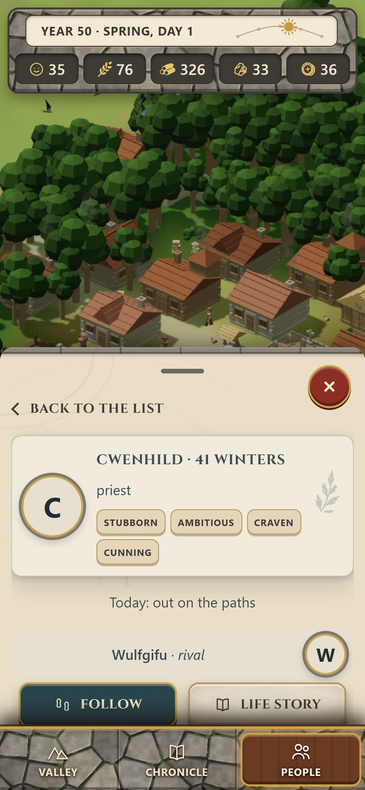</a> | **ficha-desde-lista** · La ficha abierta desde la lista: con «back to the list» |
| 21 |  | **ficha-siguiendo** · Siguiendo a alguien: la ficha baja y la cámara va detrás |
| 22 | <a href="022-ficha-vida.jpg">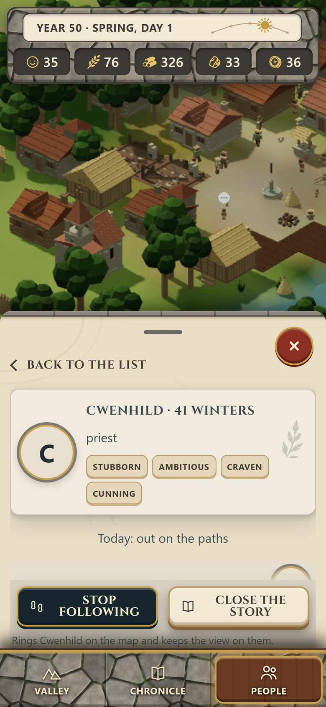</a> | **ficha-vida** · La vida de esa persona, desplegada |
| 23 |  | **ficha-vida-final** · Últimos recuerdos con acciones todavía accesibles |
| 24 |  | **carro** · El carro: lo que se le puede dar al valle y lo que cuesta |
| 25 |  | **carro-dado** · Después de dar algo |
| 26 |  | **encrucijada** · Una decisión, planteada |
| 27 | <a href="027-decision-aplazada.jpg">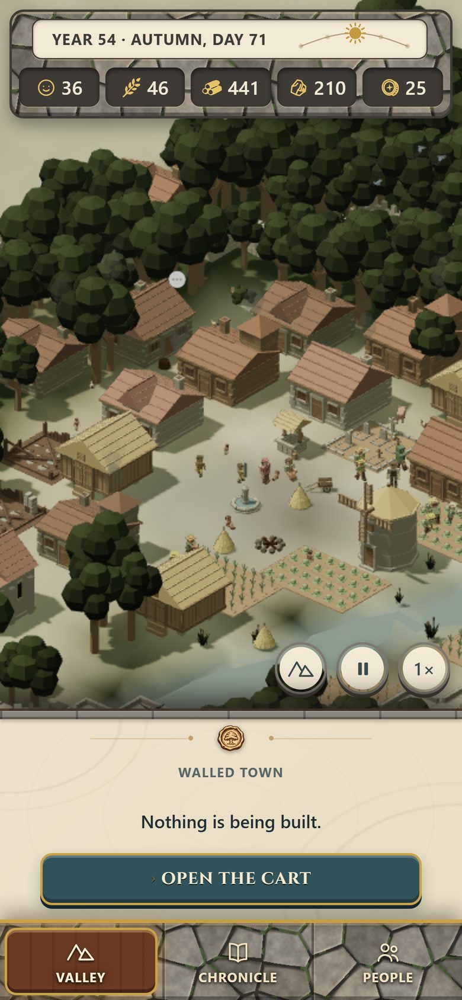</a> | **decision-aplazada** · La decisión aplazada: el sello de lacre en la bandeja |
| 28 |  | **sello** · Una decisión sin contestar: el sello de lacre en la bandeja |
| 29 |  | **oferta** · Alguien espera respuesta en el camino: los dos toques de la oferta |
| 30 |  | **corona-lista** · La corona, cuando el valle ya puede coronar a alguien |
| 31 | <a href="031-corona-puesta.jpg">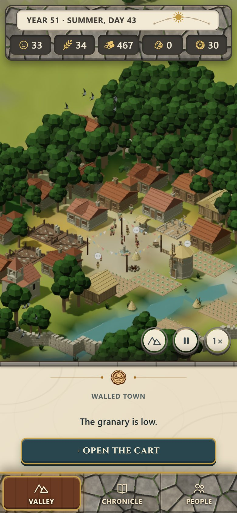</a> | **corona-puesta** · Con un herrero coronado: la sala y el estilo del valle |
| 32 | <a href="032-tocar-1.jpg">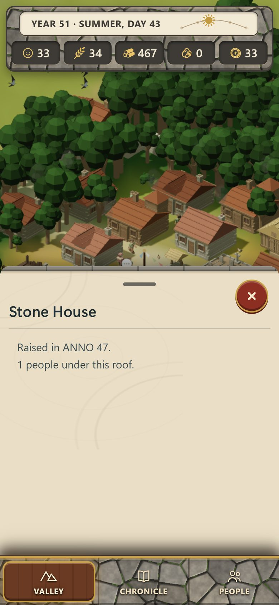</a> | **tocar-1** · Tocando el valle: Stone House |
| 33 |  | **tocar-3** · Tocando el valle: Stone House |
| 34 | <a href="034-bienvenida.jpg">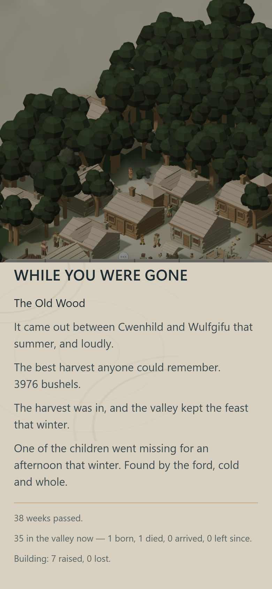</a> | **bienvenida** · El parte de bienvenida: lo que pasó mientras no estabas |
| 35 |  | **caza-boton** · Hay presa cerca: el botón de caza |
| 36 |  | **caza-arma** · La caza: elegir con qué |
| 37 |  | **caza-apuntando** · La caza: apuntando |
| 38 |  | **caza-encuentro** · La caza: el encuentro |
| 39 | <a href="039-tormenta.jpg">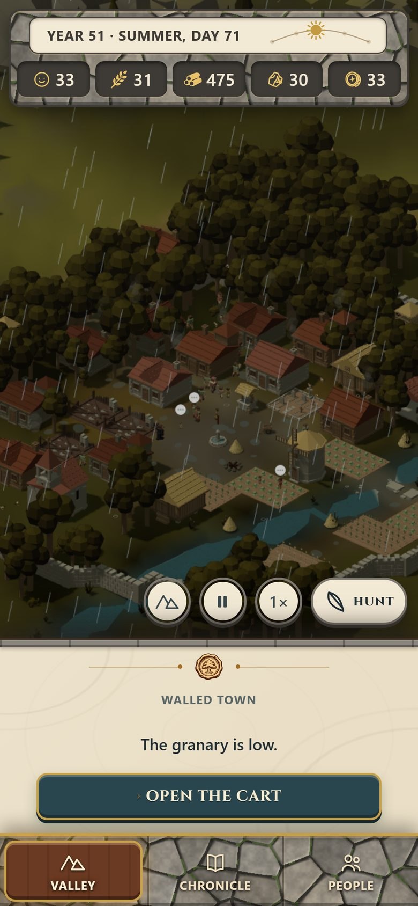</a> | **tormenta** · La tormenta: el cielo de plomo y los rayos (§10.7) |
| 40 | <a href="040-nieve.jpg">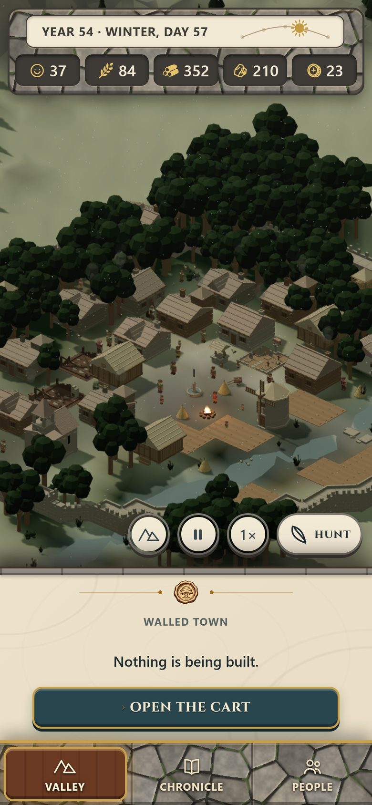</a> | **nieve** · La nieve en el valle |
| 41 | <a href="041-lluvia.jpg">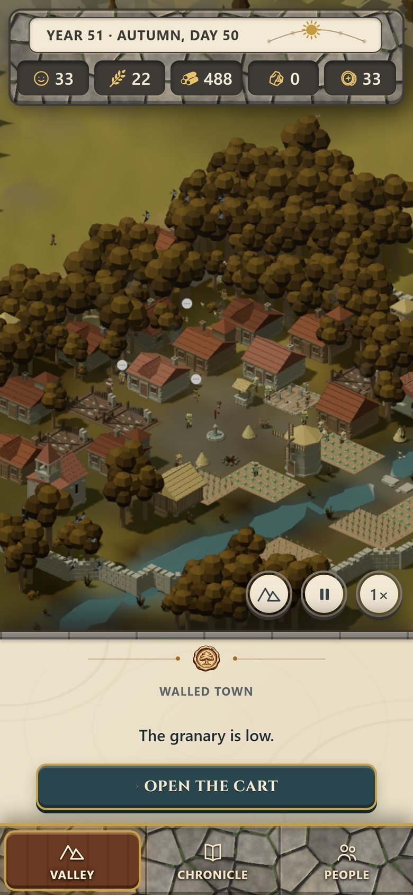</a> | **lluvia** · El valle mojado de otoño |
| 42 | <a href="042-hambre.jpg">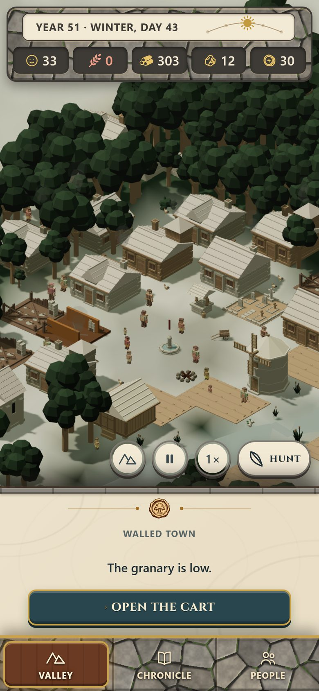</a> | **hambre** · El granero a cero: el hambre |
| 43 | <a href="043-amenaza-aviso.jpg">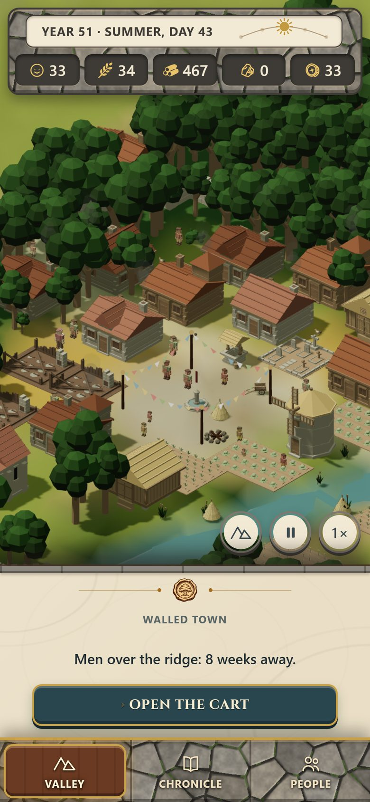</a> | **amenaza-aviso** · La crónica avisa: un clan vecino se acerca |
| 44 |  | **amenaza-pendiente** · El aviso sin leer todavía |
| 45 | <a href="045-amenaza-sin-preparar.jpg">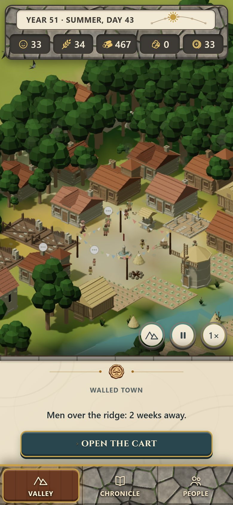</a> | **amenaza-sin-preparar** · La víspera sin prepararse |
| 46 | <a href="046-visperas.jpg">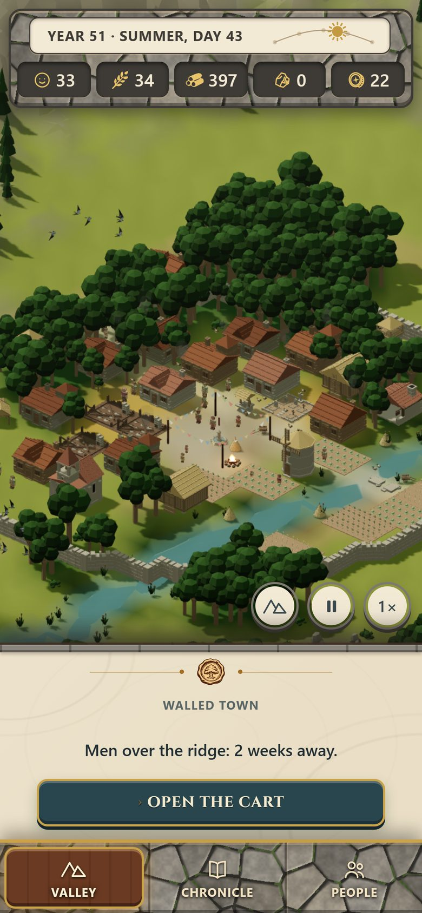</a> | **visperas** · La víspera: la guarnición sube a la muralla y no hay nadie en el camino · al llegar |
| 47 | <a href="047-visperas-b.jpg">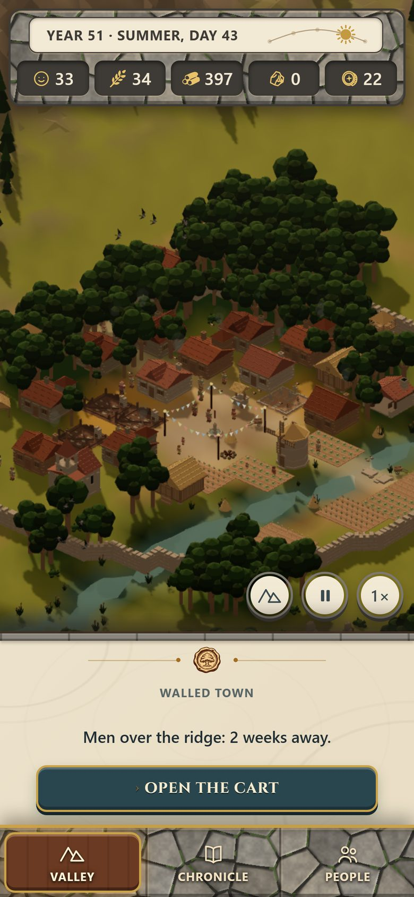</a> | **visperas-b** · La víspera: la guarnición sube a la muralla y no hay nadie en el camino · nueve segundos después |
| 48 |  | **visperas-c** · La víspera: la guarnición sube a la muralla y no hay nadie en el camino · dieciocho segundos después |
| 49 | <a href="049-saqueo.jpg">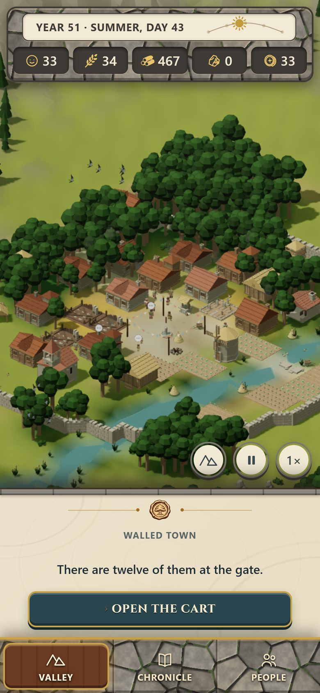</a> | **saqueo** · El saqueo: la partida del valle vecino, sin defensa dada · al llegar |
| 50 | <a href="050-saqueo-b.jpg">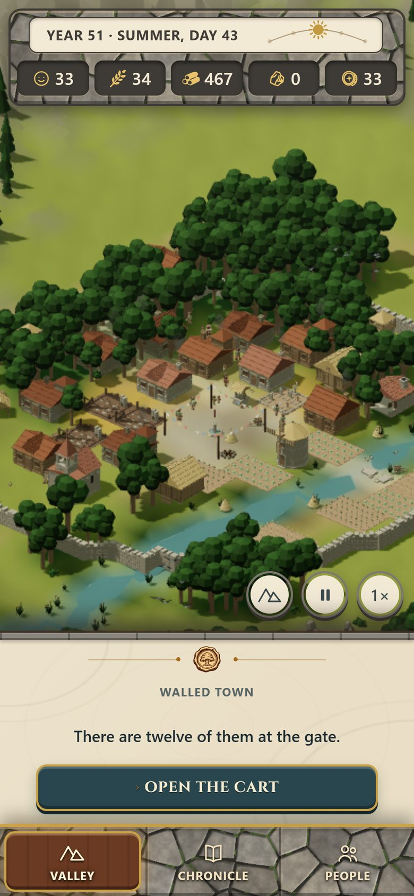</a> | **saqueo-b** · El saqueo: la partida del valle vecino, sin defensa dada · nueve segundos después |
| 51 |  | **saqueo-c** · El saqueo: la partida del valle vecino, sin defensa dada · dieciocho segundos después |
| 52 |  | **defensa** · El saqueo con arcos dados: la muralla contesta · al llegar |
| 53 |  | **defensa-b** · El saqueo con arcos dados: la muralla contesta · nueve segundos después |
| 54 | <a href="054-defensa-c.jpg">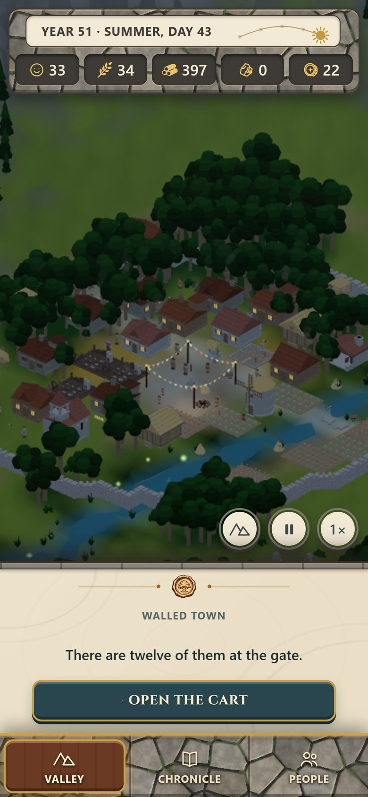</a> | **defensa-c** · El saqueo con arcos dados: la muralla contesta · dieciocho segundos después |
| 55 | <a href="055-asalto.jpg">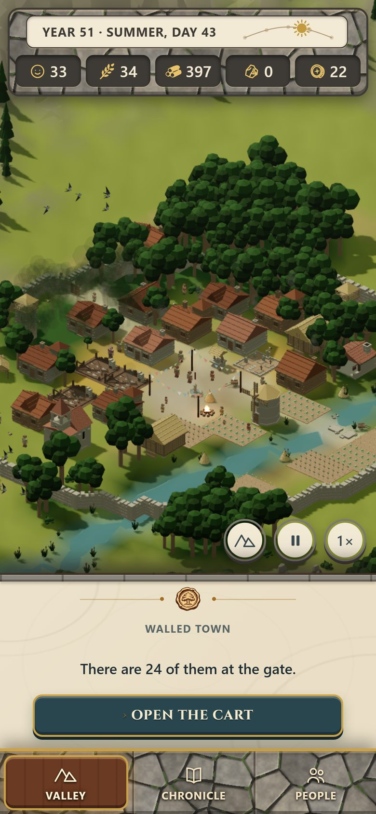</a> | **asalto** · El asalto: veinticuatro hombres a por el portón · al llegar |
| 56 | <a href="056-asalto-b.jpg">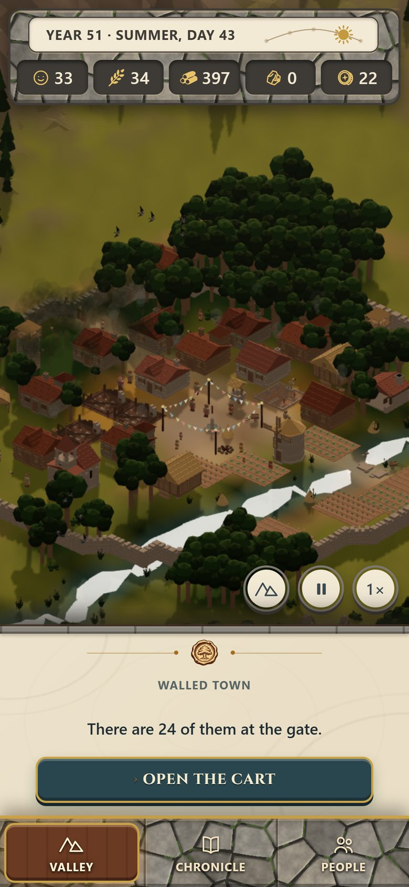</a> | **asalto-b** · El asalto: veinticuatro hombres a por el portón · nueve segundos después |
| 57 | <a href="057-asalto-c.jpg">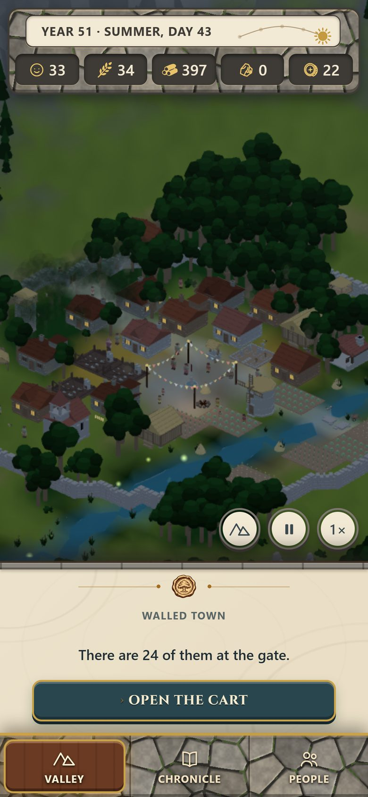</a> | **asalto-c** · El asalto: veinticuatro hombres a por el portón · dieciocho segundos después |
| 58 |  | **despues-saqueo** · Después del saqueo |
| 59 |  | **obra-porton** · El portón en obras |
| 60 | <a href="060-final-stormed-transicion.jpg"></a> | **final-stormed-transicion** · El final (valle tomado): el instante antes de la hoja |
| 61 | <a href="061-lapida-stormed.jpg"></a> | **lapida-stormed** · El valle tomado: la lápida y su inscripción |
| 62 |  | **lapida-extinction** · El valle vacío: no queda nadie: la lápida y su inscripción |
| 63 | <a href="063-lapida-abandoned.jpg"></a> | **lapida-abandoned** · El valle abandonado: la lápida y su inscripción |
| 64 |  | **lapida-dispersed** · El valle disperso: la lápida y su inscripción |
| 65 | <a href="065-final-stormed-cuentas-abajo.jpg"></a> | **final-stormed-cuentas-abajo** · El final (stormed): el resto de las cuentas |
| 66 | <a href="066-crece-ano-01.jpg"></a> | **crece-ano-01** · El valle en el año 1, sin interfaz |
| 67 | <a href="067-crece-ano-02.jpg"></a> | **crece-ano-02** · El valle en el año 2, sin interfaz |
| 68 | <a href="068-crece-ano-04.jpg"></a> | **crece-ano-04** · El valle en el año 4, sin interfaz |
| 69 | <a href="069-crece-ano-08.jpg"></a> | **crece-ano-08** · El valle en el año 8, sin interfaz |
| 70 | <a href="070-crece-ano-14.jpg"></a> | **crece-ano-14** · El valle en el año 14, sin interfaz |
| 71 | <a href="071-crece-ano-22.jpg"></a> | **crece-ano-22** · El valle en el año 22, sin interfaz |
| 72 | <a href="072-crece-ano-32.jpg"></a> | **crece-ano-32** · El valle en el año 32, sin interfaz |
| 73 | <a href="073-crece-ano-44.jpg"></a> | **crece-ano-44** · El valle en el año 44, sin interfaz |
| 74 | <a href="074-crece-ano-60.jpg"></a> | **crece-ano-60** · El valle en el año 60, sin interfaz |
| 75 | <a href="075-estacion-spring.jpg"></a> | **estacion-spring** · El valle en spring, año 30, sin interfaz |
| 76 | <a href="076-estacion-summer.jpg"></a> | **estacion-summer** · El valle en summer, año 30, sin interfaz |
| 77 | <a href="077-estacion-autumn.jpg"></a> | **estacion-autumn** · El valle en autumn, año 30, sin interfaz |
| 78 | <a href="078-estacion-winter.jpg"></a> | **estacion-winter** · El valle en winter, año 30, sin interfaz |
| 79 | <a href="079-escena-wedding.jpg"></a> | **escena-wedding** · Una boda en la plaza |
| 80 | <a href="080-escena-wedding-b.jpg"></a> | **escena-wedding-b** · Una boda en la plaza (seis segundos después) |
| 81 | <a href="081-escena-harvest_feast.jpg"></a> | **escena-harvest_feast** · La fiesta de la cosecha |
| 82 |  | **escena-harvest_feast-b** · La fiesta de la cosecha (seis segundos después) |
| 83 | <a href="083-escena-good_catch.jpg"></a> | **escena-good_catch** · Una buena pesca en el río |
| 84 | <a href="084-escena-good_catch-b.jpg"></a> | **escena-good_catch-b** · Una buena pesca en el río (seis segundos después) |
| 85 | <a href="085-escena-quarrel_in_the_square.jpg"></a> | **escena-quarrel_in_the_square** · Una riña en la plaza |
| 86 | <a href="086-escena-quarrel_in_the_square-b.jpg"></a> | **escena-quarrel_in_the_square-b** · Una riña en la plaza (seis segundos después) |
| 87 | <a href="087-escena-stranger_passes.jpg"></a> | **escena-stranger_passes** · Un forastero de paso |
| 88 | <a href="088-escena-stranger_passes-b.jpg"></a> | **escena-stranger_passes-b** · Un forastero de paso (seis segundos después) |
| 89 | <a href="089-escena-pedlar.jpg"></a> | **escena-pedlar** · El buhonero |
| 90 | <a href="090-escena-pedlar-b.jpg"></a> | **escena-pedlar-b** · El buhonero (seis segundos después) |
| 91 | <a href="091-escena-child_lost.jpg"></a> | **escena-child_lost** · Un niño perdido, y el valle buscándolo |
| 92 |  | **escena-child_lost-b** · Un niño perdido, y el valle buscándolo (seis segundos después) |
| 93 |  | **escena-wolves_at_the_coop** · Lobos en el corral |
| 94 | <a href="094-escena-wolves_at_the_coop-b.jpg"></a> | **escena-wolves_at_the_coop-b** · Lobos en el corral (seis segundos después) |
| 95 | <a href="095-escena-river_flood.jpg"></a> | **escena-river_flood** · La riada |
| 96 | <a href="096-escena-river_flood-b.jpg"></a> | **escena-river_flood-b** · La riada (seis segundos después) |
| 97 | <a href="097-escena-lightning_fire.jpg"></a> | **escena-lightning_fire** · El rayo y lo que arde |
| 98 |  | **escena-lightning_fire-b** · El rayo y lo que arde (seis segundos después) |
| 99 | <a href="099-cerco-ano-34.jpg"></a> | **cerco-ano-34** · La muralla a medias, sin interfaz |
| 100 | <a href="100-cerco-ano-34-ancho.jpg"></a> | **cerco-ano-34-ancho** · La muralla a medias, plano ancho del valle entero |
| 101 | <a href="101-cerco-ano-40-ancho.jpg"></a> | **cerco-ano-40-ancho** · El cerco cerrado, con su portón, plano ancho del valle entero |
| 102 | <a href="102-cerco-ano-55.jpg"></a> | **cerco-ano-55** · La villa hecha, de piedra, sin interfaz |
| 103 | <a href="103-cerco-ano-55-ancho.jpg"></a> | **cerco-ano-55-ancho** · La villa hecha, de piedra, plano ancho del valle entero |
| 104 |  | **banco-cargando** · El banco de batallas: «preparando la villa» |
| 105 | <a href="105-banco.jpg"></a> | **banco** · El banco de batallas con su panel |
| 106 | <a href="106-banco-panel-otro.jpg"></a> | **banco-panel-otro** · El banco de batallas con el panel del otro modo (plegado o desplegado) |
| 107 | <a href="107-banco-pelea.jpg"></a> | **banco-pelea** · El banco de batallas, medio minuto después |
