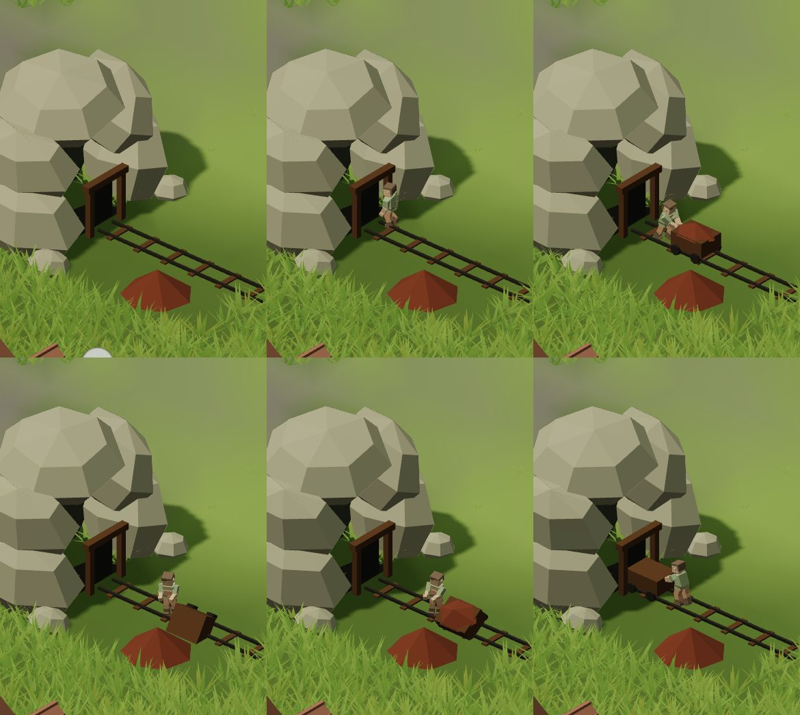

# AR-2 · La mina: medidas (2 oct 2026, v5.86)

Rama `claude/ar2-mineria`. Qué se midió para decidir, con qué herramienta y en
cuántas semillas. El diseño está en `docs/design.md` §7.18.

## 1 · Cuándo llega la Edad del Hierro (horas de reloj a ×1)

`npx tsx tools/reports/pace-report.ts` (24 semillas × 60 años, prudente), con
el peldaño nuevo `EDAD DEL HIERRO (mina)` en `tools/reports/ladder.ts`:

| peldaño | `main` (24683e3) | con la mina |
|---|---:|---:|
| herrería | 42 h | 42 h |
| EDAD DE PIEDRA (1ª obra) | 61 h | 61 h |
| molino | 61 h | 61 h |
| **EDAD DEL HIERRO (mina)** | — | **71 h** (38–104 h, 22/24) |
| primer asalto | 136 h | 136 h |
| portón | 194 h | 207 h |
| VILLA CERRADA | 329 h (21/24) | 362 h (22/24) |
| bastión | 491 h (20/24) | 491 h (18/24) |
| población al final, mediana | 56 | 50 |
| partidas acabadas | 2/24 | 2/24 |

La mina llega **diez horas después de la piedra** —la regla de Vera: «la edad
del metal después de la de piedra»— y siempre después de ella (la prueba lo
vigila en tres semillas). Las cuatro edades de la armadura quedan: Cuero 42 h
(la herrería), **Hierro 71 h**, Acero 362 h (la villa cerrada con piedra).

**El precio, que se queda escrito:** la mina se lleva hasta un cuarto de las
manos de la obra mientras el acopio tiene sitio, y eso retrasa la villa
cerrada unas 33 h de mediana y deja la población final en 50 contra 56. La
letalidad no se mueve. El mineral no da nada todavía (lo gastará AR-1), así que
este coste es lo que el nivelado tendrá delante; las cifras son `TUNE` en
`MINE` (`balance.ts`).

## 2 · De dónde salen los mineros (12 semillas × 60 años)

Variantes medidas con un guion en el cuaderno de la sesión (las semillas
`3 + 14·i`; mediana de la población final, villas cerradas y en qué parte de
las semanas de la Edad del Hierro hay alguien en la mina):

| variante | población | villas | mina trabajando |
|---|---:|---:|---:|
| N · sin mina (equivale a `main`) | 53 | 10/12 | — |
| B · mina construida, sin mineros | 50 | 11/12 | 0 % |
| A · mineros de lo que sobra, **antes del bosque** (la primera versión) | **37** | 8/12 | 86 % |
| D · como A, pero con una décima de lo que sobra | 34 | 8/12 | 97 % |
| I · sólo con la obra parada (la regla de la cantera de M-0) | 46 | 10/12 | 69 % |
| **J · de las manos de la obra, después del bosque** (la que queda) | **48** | 11/12 | **95 %** |

Lo que enseña: **construir la mina no cuesta** (B ≈ N); lo que hundía la aldea
era quitar manos **antes del bosque**, porque la leña es lo que aprieta (K3) y
una mano menos al bosque se nota cincuenta años. Sacándolas de la obra, el
coste queda dentro del ruido de doce semillas y la mina se ve trabajar casi
siempre. La I queda como interruptor (`MINE.IDLE_YARD_ONLY`), apagada.

**Y una que se arregló antes de medir nada de esto:** sin gasto, el acopio se
llenaba en año y medio y la mina se paraba para el resto de la partida (semilla
7, año 6: ningún minero en la boca, la toma vacía). La fragua encendida gasta
`MINE.SMITH_ORE` a la semana —el hierro de todos los días— y eso mantiene la
mina viva.

## 3 · El tick

`npx tsx tools/reports/tick-bench.ts` (40 años, semillas 7, 23 y 41), porque
se toca `works.ts`: **3,80 ms por semana en `main` y 3,41 en la rama** (la
veta se busca sólo el día que se abre la obra). Vivos al final: 80/42/65 en
`main`, 74/29/78 con la mina (la trayectoria es otra desde el año ~5).

## 4 · Lo que se ve

Toma del observatorio (`observe-life.mjs --seed 7 --year 8 --lead 5
--seconds 30 --fps 2 --look 21.5,56.5 --zoom 0.08 --viewport 390x844`), con
los respaldos procedurales (los GLB de Astra no están en `main`):

En la vida, sin navegador (`tests/fast/life-mine.test.ts` y una sonda de
cuatro jornadas en la semilla 7): el minero pasa de 1 800 a 3 600 pasos de una
jornada dentro de la mina (no se pinta), vuelca de 5 a 6 vagonetas por jornada
y pica la ladera cuando la vagoneta está fuera con otro.

**Lo que no se ve bien todavía**, en `docs/encargos-3d.md`: el marco del
respaldo queda un palmo a un lado del hueco de la cueva del oso; las ruedas no
giran; volcar usa el `sort` de siempre; el acopio está en la boca y no junto a
la herrería. Y **sin medir en el aparato**: unas siete llamadas de dibujo más
con la mina en pie, una sola con sombra (la boca).
