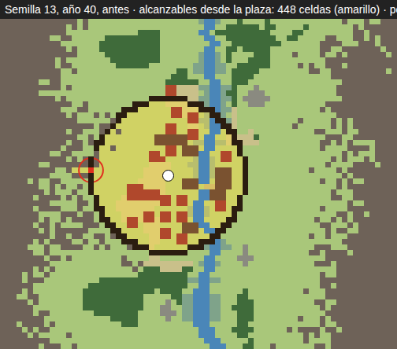
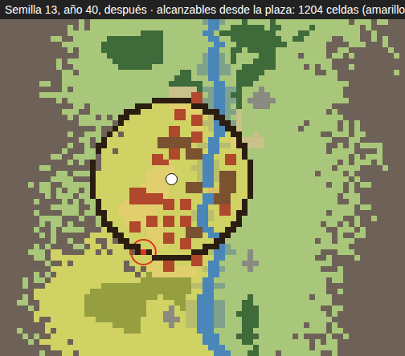

# El cerco sin salida (v5.89, 2 oct 2026)

Carril de la tanda del 2 oct (director `session_01EYvYxVxEhUmyBSSTytRT3u`),
rama `claude/cerco-sin-salida`. Lo pidió Vera con su regla: **lo que rompe la
partida se arregla en la ronda.** El defecto lo midió #48 (valle natural,
`valle-forma-2026-10-02.md` §6): a los cuarenta años, 3 de 24 valles alcanzan
menos de 500 celdas porque el único portón da a la montaña.

## 1 · La causa

La regla del portón (`placeBuilding`, A2b, `crossable`) pide dos cosas a la
celda de la puerta: que por dentro dé a las casas y que por fuera dé a
`exterior`. Y `exterior` era una inundación sembrada en **cualquier celda
transitable a más de `ring + GATE_CLEAR` de la plaza**. Una bolsa de prado que
el cerco deja contra la montaña cumple eso: está fuera del anillo, es prado, y
está desconectada de todo lo demás. Con el valle natural el cerco sale a la
falda y se apoya en la sierra con más frecuencia, y las bolsas aparecen más.

En la semilla 13 (año 40) el portón está en (16, 53), en el lado de poniente
del anillo. Por fuera tiene tres celdas de prado —(13..15, 53)— cercadas de
montaña. El pueblo alcanza 448 celdas: él mismo y nada más.

## 2 · El arreglo

**Fuera es lo que llega a las gargantas.** La inundación de `exterior` se
siembra en las celdas transitables de la primera y la última fila del mapa,
que son las dos gargantas por donde entra el río y por donde llega cualquiera
de fuera (el forastero, el buhonero, la partida). Lo que comunica con ellas es
el resto del valle, con sus campos, su bosque y sus caminos. Si un mapa no
tuviera garganta transitable (hoy no se genera ninguno), vale la siembra de
antes.

Es una línea de criterio, no una regla nueva: la puerta sigue eligiéndose por
lo pisado y la cercanía a la plaza, y sólo deja de valer la que da a una bolsa.
No hay constante nueva y no cambia el esquema. **Lo que cierra el anillo** no
ha hecho falta tocarlo: con el portón bien puesto, ningún valle de las dos
series queda encerrado (abajo).

Con la regla nueva, el portón de la semilla 13 sale en (25, 67), al sur, y da
al prado y al bosque de la garganta: 1 204 celdas.

Las capturas del juego en el mismo año (`shot.mjs --seed 13 --year 40
--scene-only --tilt 40 --zoom -4`) están en `cerco-img/semilla13-antes.png` y
`cerco-img/semilla13-despues.png`. La cámara del menú no encuadra el lado de
poniente, así que la evidencia que cuenta son los planos.

## 3 · La medida

`npx tsx tools/reports/enclosure-report.ts` (nuevo). Juega con `run` y la
política prudente, y cuenta las celdas que se alcanzan andando desde la plaza
con lo construido cerrando el paso (`walkingBlocked`), como para las rutas.
Cuarenta años, dos series de 24 semillas.

| | semillas 1–24 (las de #48) | semillas 3 + 7i |
|---|---:|---:|
| < 500 celdas, antes | **3** (6: 364 · 13: 448 · 17: 399) | **2** (17: 399 · 59: 441) |
| < 500 celdas, después | **0** | **0** |
| < 1 200 celdas, antes → después | 8 → 6 | 6 → 6 |
| valles que cambian | 6, 11, 13, 17 | 17, 59, 66, 136 |

Los que cambian, antes → después: semilla 6, 364 → 2 885; 11, 2 994 → 3 657
(el portón se va de 14,44 a 24,37); 13, 448 → 1 204; 17, 399 → 1 027;
59, 441 → 903; 66, 1 217 → 1 809; 136, 666 → 1 060. **Los demás juegan la
misma partida** (mismas cifras; y en el tick-bench, las huellas de las
semillas 7, 23 y 41 son idénticas).

**Por debajo de 1 200 siguen seis**, y no es este defecto: todos esos portones
dan a una garganta. Es el río. Si el vado queda dentro del anillo y el pueblo
tiene una sola puerta, la otra orilla sólo se alcanza cruzando por dentro, y
por fuera sólo queda la orilla de la puerta (en la 13, el cuadrante del
suroeste). Va a abiertos.

## 4 · El ritmo, en horas a ×1

`pace-report.ts`, 24 semillas × 60 años, antes y después:

| peldaño | antes | después |
|---|---:|---:|
| muralla | 193 h (22/24) | 193 h (22/24) |
| portón | 194 h (22/24) | 194 h (22/24) |
| VILLA CERRADA | 329 h (21/24) | 329 h (21/24) |
| muralla de piedra | 330 h | 330 h |
| bastión | 491 h (20/24) | 459 h (19/24) |

Lo único que se mueve es el bastión, que llega después del portón: en los
cuatro valles cuya puerta cambia de sitio la partida es otra desde entonces,
y uno de ellos ya no levanta bastión antes de los sesenta años. La villa
cerrada y la primera muralla no se mueven: el portón se cuelga cuando el
cerco ya existe, y sólo cambia dónde.

## 5 · El tick

`tick-bench.ts` (semillas 7, 23 y 41, cuarenta años): 4,71 ms por semana
antes (medido con otra partida corriendo al lado) y 4,18 después, con los
mismos vivos y **las mismas huellas** de crónica, gente, edificios, tráfico y
sendas. La inundación nueva se paga una vez por portón, igual que la de antes.
No hay subida.

## 6 · Las pruebas

- `tests/journeys/enclosure.test.ts` (unos 30 s): en las semillas 6, 11, 13 y
  17 a los cuarenta años, **cada portón en pie da por un lado a suelo que
  llega a una garganta**, y el pueblo alcanza al menos 500 celdas. Contra el
  código de antes, las dos caen en la semilla 6 (portón en 24,56; 364 celdas).
- Suite rápida entera en local: 217 ficheros, 2 132 pruebas, en verde.
- Las doce jornadas más cerca del portón (gates, wall-rings,
  wall-rings-gates-era, assault, garrison, archery, e3b-corridor, e3b-rampart,
  threat-defence, life-places, works y la nueva): 93 de 93 en verde.

## 7 · Abierto

- **El río parte el exterior.** Con el vado dentro del anillo y una sola
  puerta, la otra orilla se alcanza sólo por dentro: seis valles de 24 se
  quedan entre 900 y 1 200 celdas. No encierra a nadie, pero es la mitad del
  valle. La segunda puerta (A2c, `GATE_APART`) lo arregla cuando llega; que la
  regla la pida en la otra orilla sería otra ronda.
- **Una obra que tapa el portón por dentro** (la semilla 37 antes de RD-3, en
  `life-places.test.ts`): una casa o una iglesia entre el portón y la plaza. La
  reserva del túnel (`inGateway`) lo evita en la mayoría; esta ronda no lo ha
  tocado y en las dos series no aparece.
