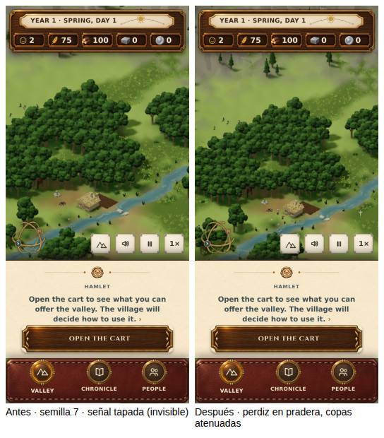

# D1 y D7 · la primera ocasión del mapa y el tablón, medidos antes y después (30 sep 2026)

Defectos de `rd0-apertura-visible-2026-09-30.md` §3. Paquete del juego
(`tools/graphics/bundle-game.ts`) de `main` `debf7f8` contra esta rama;
Chromium por software, 390×844, dpr 2, táctil, cámara de apertura tras el
vuelo de entrada.

## D1 · la señal de la caza de la fundación

`node artifacts/rd0/signscan.mjs <valley.html> 1,…,12 <salida.json>`: doce
muestras de `.hunt-sign` por semilla, en la semana 0.

| Semilla | Oferta en la semana 0 | Antes | Sólo margen de pradera | Margen + copas atenuadas |
|---|---|---|---|---|
| 1, 2, 4, 9, 10 | no (`huntOpportunity` = null) | — | — | — |
| 3 | perdiz | tapada | tocable | **tocable** |
| 5 | perdiz | tocable | tocable | **tocable** |
| 6 | perdiz | tocable | **tapada** | **tocable** |
| 7 | perdiz | tapada | tocable | **tocable** |
| 8 | perdiz | tapada | tapada | **tocable** |
| 11 | perdiz | tocable | tocable | **tocable** |
| 12 | perdiz | tocable | tocable | **tocable** |
| **Tocables** | | **4 de 7** | 5 de 7 | **7 de 7** |

El margen solo no basta —tapar depende de la dirección de la cámara y de
árboles más lejanos, y en la 6 empeoró—; lo que lo cierra es atenuar las copas
que se interponen, como GV-2 hace con quien se sigue.

## D7 · el tablón en el encuadre

`node artifacts/rd0/boardframe.mjs <valley.html> 7 <salida.json>`, a ×64, la
posición del tablón en píxeles CSS en cada semana:

| Semana | Antes (x) | Después (x) |
|---|---:|---:|
| 0 | 119 | 141 |
| 2 | 21 | 71 |
| 3 | **−19** (fuera) | 42 |
| 4–14 | **−23** (fuera) | 39 |

## Qué lo refutaría

Una semilla con oferta en la semana 0 cuya señal, con la cámara de apertura,
siga tapada o no sea el elemento de encima en su punto; o una aldea que
crezca de modo que el tablón vuelva a salir de cuadro sin que el jugador haya
movido la cámara. Sin medir: 320×568, otras especies y el móvil real.
