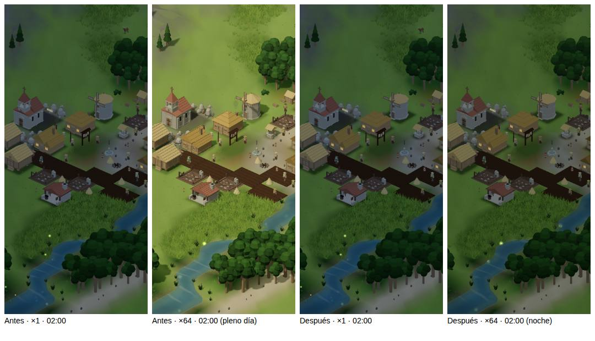

# El sol vuelve a decir la hora a ×16 y ×64 (RD-0, v5.38)

**30 sep 2026.** Primer arreglo del rework de ritmo
(`docs/plan-ritmo-descanso-y-progresion-2026-09-29.md` §6, «bloqueo de
coherencia»). La simulación, el reloj de la cabecera (`hourAt`) y el sol ya
leían la misma fase (`dayPhase(presentationSeconds)`); lo único que se
separaba era la luz pintada, que `LIGHT_STEADY` aplanaba hacia la media mañana
(55 % a ×16, 95 % a ×64). La duración del tick no cambia.

## Qué se vio

Semilla 11, año 10, cielo claro, la hora fijada en la fase 0,02 (≈ 01:40 en la
cabecera) con `tools/graphics/shot.mjs --phase 0.02 --speed <v> --scene-only`,
sobre el paquete de `main` (`debf7f8`) y sobre esta rama:

- **Antes, ×64**: pleno día con sombras duras y sin ventanas encendidas, con la
  cabecera en plena noche. Es el desacople que Vera prohibió el 29 sep.
- **Después, ×64**: es de noche —sol apagado, sin sombras, ventanas
  encendidas— con el cielo algo más claro que a ×1, que es la comodidad que se
  conserva.

Las capturas enteras quedan en `artifacts/rd0/sol/` (no versionadas).

## La regla nueva

A ×16 y ×64 se suaviza **la amplitud**, nunca la hora (`LIGHT_SWING` en
`src/render3d/effects/daylight.ts`: 0,7 y 0,45 del contraste de ×1, hacia el
punto medio entre mediodía y medianoche). La dirección del sol, si alumbra o
no y las ventanas son las de la hora a cualquier velocidad. El sonido ya
seguía la hora (pájaros de día, grillos de noche) y sólo baja el volumen.

## La prueba (`tests/fast/graphics-effects.test.ts`)

1. En 240 fases y las cinco velocidades, la dirección del sol es la de ×1 y
   alumbra exactamente cuando alumbra a ×1.
2. El orden de claridad entre dos horas cualesquiera es el mismo a cualquier
   velocidad.
3. A ×64 queda al menos el 40 % de la jornada: la noche se lee como noche.

Con el código anterior fallan la 1 y la 3.

## Lo que queda y qué lo refutaría

- **No medido en un aparato.** El contenedor pinta a ~0 fps por software, así
  que una película a ×64 no sirve de prueba aquí; la comprobación de
  comodidad (si a ×64 la jornada suavizada molesta) es de Vera en la tablet.
- **Refutaría el arreglo** una captura, a cualquier velocidad, en que la
  cabecera diga noche y el valle proyecte sombras de sol o tenga las ventanas
  apagadas, o al revés; o que a ×64 la alternancia día-noche resulte más
  molesta que el aplanado anterior al mirarla en el aparato (entonces se toca
  `LIGHT_SWING`, nunca la fase).
