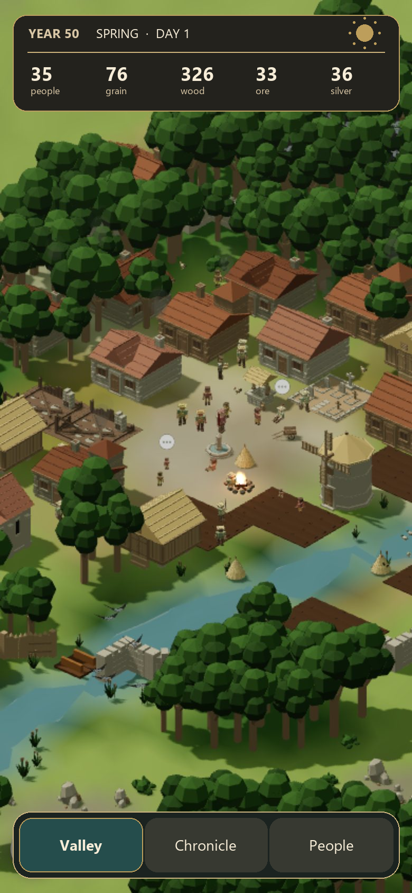
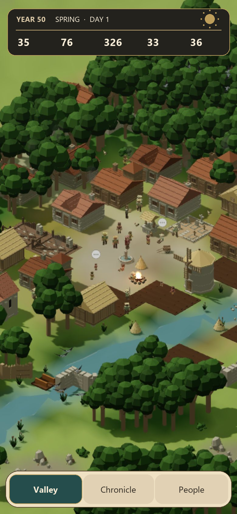
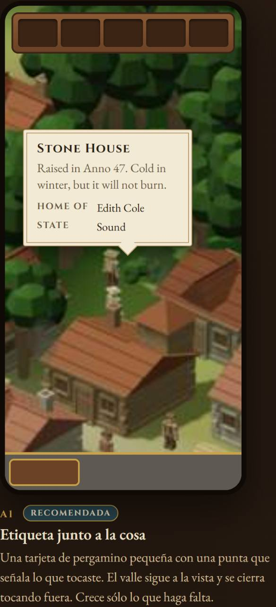
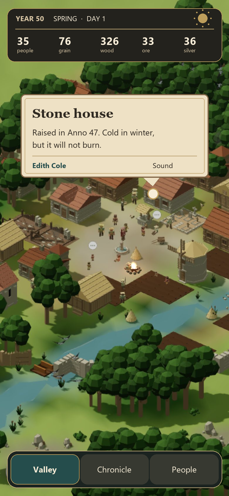
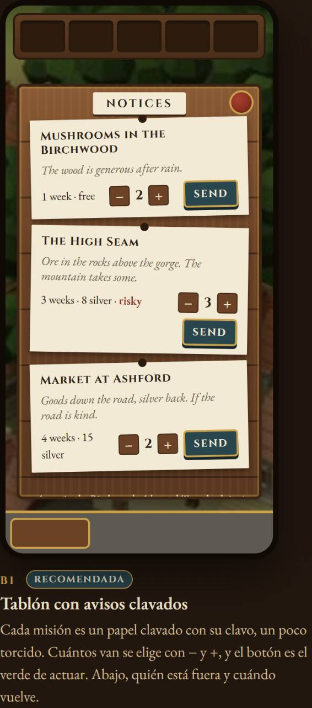
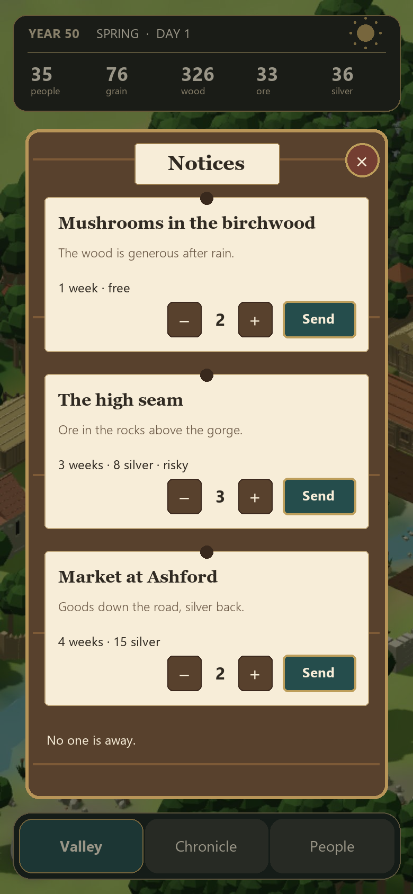
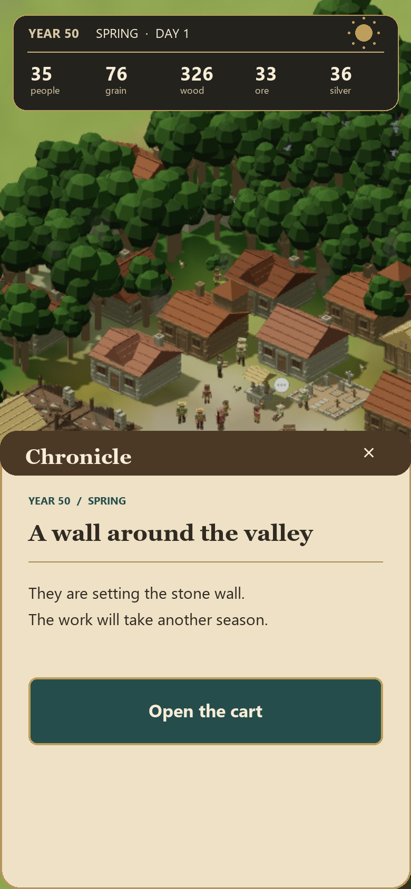

# The Valley — propuesta detallada de la nueva interfaz

**28 de septiembre de 2026 · Propuesta para revisión de Vera · No es todavía una regla de `design.md` ni una captura del juego implementado.**

## 1. La idea

**Un valle vivo y una interfaz hecha de sus objetos.** La pantalla principal deja
que el mundo 3D ocupe el centro. El jugador mira primero el lugar y, cuando
toca algo, recibe justo el instrumento que necesita: una etiqueta para leer,
una superficie de madera para decidir o una hoja para recorrer la crónica.
La nueva piel busca tacto de juego medieval inglés con composición y lectura
actuales. La textura se reconoce al acercarse; no compite con la aldea.

La intervención memorable es **el objeto que abre su propia ventana**. El
tablón de misiones de v4.95 es el primer caso. Una casa o una persona muestra
una etiqueta anclada a lo tocado; otras decisiones podrán abrir instrumentos
propios. No se añaden controles persistentes para anunciar esas acciones.

### Decisiones ya expresadas por Vera

- Rehacer la piel completa: composición, jerarquía, botones, cabecera, hojas y
  ventanas. La botonera inferior pierde el fondo de piedra agrietada.
- Mantener un equilibrio entre artesanía medieval y claridad moderna. La letra
  de lectura y de control será limpia; el acento histórico quedará en títulos,
  materiales e iconos propios del juego.
- Crónica, gente y carro deben dejar visible aproximadamente la mitad superior
  del valle al abrirse, siempre que el contenido y el teclado lo permitan.
- Cabecera con los cinco valores, algo más compacta. Probar dos tratamientos
  de la misma información. La era cambia emblemas y acentos, no toda la materia.
- Navegación inferior flotante, sobre una tira translúcida de poca altura;
  comparar variantes antes de cerrar su acabado.
- **Papel = leer. Madera = decidir.** Los dos papeles no se mezclan en una
  ventana. Elegidas las maquetas **A1** (etiqueta junto a la cosa) y **B1**
  (tablón con avisos clavados). Se conserva su concepto y su posición, y se
  rehace su acabado para que pertenezcan a la nueva piel.

## 2. Evidencia y alcance de la propuesta

La base fotografiada es la UI del [27 de septiembre](../interfaz/2026-09-27/README.md),
en especial [valle](../interfaz/2026-09-27/ui/007-valle.jpg),
[crónica](../interfaz/2026-09-27/ui/016-cronica.jpg),
[carro](../interfaz/2026-09-27/ui/024-carro.jpg) y
[encrucijada](../interfaz/2026-09-27/ui/026-encrucijada.jpg). Las láminas de
abajo son **montajes de diseño** sobre la captura limpia
[`010-valle-despejado.jpg`](../interfaz/2026-09-27/ui/010-valle-despejado.jpg),
generados por [`render-propuesta-2026-09-28.py`](render-propuesta-2026-09-28.py).
No prueban por sí mismas ni el estado real de v4.95 ni el rendimiento del
juego. Se preservaron los cinco bocetos recibidos en
[`referencias-ventanas-2026-09-28/`](referencias-ventanas-2026-09-28/README.md).

Según la entrega comunicada de **main `257818e` (v4.95)**, ya existen el
objeto `src/render3d/world/notice-board.ts` y la ventana
`src/ui/redesign/board.ts`. El toque del objeto todavía no llega a la ruta
`{ kind: 'board' }`; esto es un defecto funcional pendiente de esa entrega,
registrado aquí para que la nueva piel no oculte el problema. Las llegadas y
expediciones de esa versión se ven en mapa y crónica, sin otra UI nueva.
Esta propuesta no modifica el motor, las reglas de misiones ni el contenido.

### Diagnóstico de diseño

| Evidencia | Consecuencia | Respuesta propuesta |
|---|---|---|
| En la captura del valle, cabecera y zócalo inferior de piedra forman dos marcos grandes. | La escena parece encajada entre piezas de UI. | Cabecera más corta; navegación flotante de una sola línea, sin piedra. |
| Los cinco valores son visibles, pero ocupan dos filas gruesas con cinco cajas independientes. | El estado pesa tanto como el mundo. | Una banda de lectura compacta con cifras de anchura estable y nombres discretos. |
| Crónica, carro y decisión usan familias de jerarquía distintas. | Cuesta reconocer qué se lee, qué se paga y qué acción altera el juego. | Sistema de títulos, costes, consecuencias y botones por función, con el mismo ritmo. |
| La inspección en hoja y el tablón v4.95 conviven con gestos distintos. | Tocar un objeto no anticipa el tipo de respuesta. | Contrato material: A1 para lectura contextual; B1 y futuras superficies de madera para decidir. |
| Hay buen dibujo material, pero el relieve y los contornos aparecen casi en cada pieza. | Ninguna acción destaca lo suficiente. | Una sola acción principal por superficie; borde, textura y sombra según importancia. |

## 3. Comparación visual

| Actual | Nueva piel, hipótesis A | Nueva piel, hipótesis B |
|---|---|---|
|  |  |  |

La composición es la misma dirección artística; **A/B solo comparan cabecera
y navegación**. Recomiendo A como base: la banda oscura se separa mejor del
terreno claro y conserva el tacto del juego. B permite medir si una tira más
ligera deja respirar más el paisaje. Ambas se deben ver sobre noche y lluvia
antes de elegir. Las láminas usan nombres de recursos como marcadores de
jerarquía, no proponen sustituir los iconos existentes. El reloj solar se
redibujará con el icono ya aprobado; el punto luminoso de la lámina solo
marca su posición.

| Patrón elegido | Boceto de Vera | Acabado propuesto |
|---|---|---|
| A1 · lectura contextual |  |  |
| B1 · decisión del objeto |  |  |
| Hoja de navegación |  |  |

Las opciones [A2](referencias-ventanas-2026-09-28/A2-ficha-centrada.jpg),
[A3](referencias-ventanas-2026-09-28/A3-placa-inferior.jpg) y
[B2](referencias-ventanas-2026-09-28/B2-tablon-filas.jpg) quedan como
comparación histórica, no como alternativas activas. La lámina del tablón
resume visualmente contenido real de v4.95; las frases, cifras, riesgo y
disponibilidad finales vendrán del banco y del estado, no del dibujo.

## 4. Lenguaje visual y tokens de diseño

La propuesta usa cinco tonos base. Los códigos son **objetivos de prototipo**,
no constantes aprobadas hasta verlos en el juego a plena luz, de noche y bajo
lluvia.

| Rol | Referencia | Uso |
|---|---|---|
| Tinta | `#302A22` | Texto sobre papel; evita negro puro. |
| Papel claro | `#F7EDD8` | Etiquetas, avisos clavados, lectura corta. |
| Pergamino | `#EEE1C5` | Hojas extensas y superficies de lectura. |
| Madera mate | `#58412D` | Contenedor de decisiones; vetas muy tenues y siempre subordinadas al texto. |
| Verde de acción | `#254D4C` | Acción principal y selección persistente. No significa éxito narrativo. |
| Latón apagado | `#BD9E5B` | Contorno de foco, borde de acción, clavos y acentos puntuales. |

La cabecera y la tira inferior usan carbón cálido translúcido, ligado a la
sombra del paisaje. No hay placa de piedra debajo de la navegación. Piedra,
si una era o un objeto la necesita, queda en ese objeto y no se extiende a la
UI global. El rojo de riesgo o de lacre se reserva para riesgo/cierre; no
compite con el verde de actuar. La rugosidad del papel y la veta de la madera
se sitúan debajo del texto con un contraste mínimo. Se propone una luz
superior izquierda común para relieve y sombra, sin marcos dobles en cada
control.

**Tipografía.** Un sans humanista local, sujeto a probar render en iPhone e
iPad, para cantidades, navegación, instrucciones y cuerpo de lectura. Un serif
sobrio para título de crónica y título de aviso, sin usarlo en cifras o
controles. El logotipo y los iconos propios se conservan. Tamaños CSS de
arranque: cuerpo 15–16 px/1,45; datos 17–18 px con cifras tabulares; títulos
de hoja 22–26 px; textos secundarios 12–13 px con contraste comprobado. No
poner todo en mayúsculas ni encadenar rótulos decorativos.

**Geometría.** Radios de 4–6 px en aviso/nota, 8–12 px en botón y 14–18 px
en contenedor flotante. Bordes de 1 px como separación; 2 px donde el foco o
la acción principal lo requieran. Separación base 8 px, con ritmos de 12, 16
y 24 px. La diferencia de formas ayuda a reconocer papel, madera y control.

## 5. Reglas por superficie

### Valle y cabecera

El valle sigue dibujándose tras todas las superficies. La cabecera ocupa una
banda compacta dentro del área segura superior; muestra año, estación/día,
reloj solar y los cinco valores existentes. Los números usan celdas estables
para no desplazar columnas al crecer. El toque sobre un recurso puede revelar
su detalle sin sustituir la lectura instantánea de los cinco. Si 320 px de
ancho o la traducción futura aprietan, se reduce primero el texto secundario
y se expande detalle al tocar; ninguna cifra desaparece sin alternativa.

Estados a dibujar: juego normal, pausa, valor que cambia, valor crítico,
periodo de noche/lluvia, año de tres cifras, cinco valores largos y primera
partida. Una alerta debe ser específica y breve. El reloj conserva la
posición y función de la UI actual, con menor marco.

### Navegación inferior

Tres destinos persistentes actuales: **Valley, Chronicle, People**. Una tira
translúcida apenas mayor que los botones flota sobre la escena y respeta el
área segura inferior. El destino activo tiene forma y contraste propios,
además del color. El texto no descansa directamente sobre una imagen de alto
contraste; la variante B requiere fondo claro real bajo cada botón.
La caza, la pausa, la velocidad y otros controles del valle conservan su
función, pero se ordenan como grupo aparte con prioridad menor que la
navegación; el prototipo funcional deberá demostrar que no se tapan entre sí
en móvil estrecho. El toque, foco y pulsación cambian luz/relieve en la propia
pieza durante 120–180 ms; sin rebotes ni movimiento ornamental continuo.

### A1 · papel anclado a edificio o persona

Un toque sobre el objeto abre una etiqueta de papel **cerca del punto
proyectado del objeto**. La punta señala la cosa tocada, con desplazamiento
para evitar cabecera y barra inferior. Si no cabe arriba, aparece debajo o a
un lado; si la cámara mueve el objeto, la etiqueta lo sigue sin saltos
bruscos. Se cierra al tocar fuera, al tocar otra cosa o al usar Atrás/Escape.
Para lector de pantalla y teclado recibe nombre, contenido y salida
equivalentes a un diálogo ligero. No debe requerir acertar con la punta para
cerrar.

Contenido mínimo: nombre, una frase de carácter o función y 1–2 datos
relevantes (p. ej. casa/habitante/estado). La información de edificio/persona
que hoy aparece en hoja pasa a un **componente informativo genérico** con
plantillas por tipo, sin convertir la etiqueta en una ficha enorme. Más
contenido se revela dentro de papel extensible o se enlaza a una vista de
lectura, conservando la regla de que A1 no decide acciones. Máximo inicial
aprox. 320 CSS px de ancho en 390 px de pantalla, 40–45 % de alto; si
desborda, scroll interno visible y punto de anclaje estable.

### B1 · madera al tocar el tablón

El tablón de la plaza abre una ventana sobre el valle atenuado. La madera
pertenece al contenedor y a los controles de decisión; **cada misión es un
papel clavado**, tal como en B1. En el aviso: nombre, frase, semanas, plata,
riesgo, selector −/+, número elegido y botón **Send** propio. El coste y la
disponibilidad se explican junto al aviso afectado. El área de estado al pie
muestra quién está fuera y cuándo vuelve. Si no hay misiones, se presenta el
mensaje de valle pequeño. Se cierra con sello de lacre, toque fuera o
Atrás/Escape. El cierre nunca se confunde con el botón de enviar.

Estados necesarios: disponible; fuera de temporada; falta de plata; no hay
manos libres; ya están fuera; límite mínimo/máximo del selector; misión
enviada; grupo de regreso; lista vacía; texto largo; scroll. Un botón
deshabilitado indica **por qué** y conserva legibilidad. El riesgo se escribe
con palabras (Safe / A little risk / Dangerous), no solo con color. El aviso
no puede iniciar una expedición por tocar una fila; requiere Send. El defecto
actual toque→ruta se corrige al integrar este patrón, con prueba de apertura
desde el objeto 3D, no solo de render de la ruta.

### Hojas: crónica, gente y carro

La hoja abre desde abajo y deja visible la parte superior del valle. Objetivo
inicial: borde superior alrededor del **48–52 % de la altura útil** en móvil
vertical, ajustable por contenido y teclado. Tiene agarradera o cabecera
clara, scroll en el contenido y cierre/volver. No se apilan hojas sin control;
una transición entre destinos sustituye la hoja activa y mantiene el valle
detrás. La acción principal queda a la vista dentro de la hoja cuando toca
decidir, sin tapar texto ni confundirse con el destino de navegación.

- **Crónica:** título de hecho, cuándo ocurrió, texto, grabado existente y
  vínculo contextual si hay acción. Lista y lectura comparten jerarquía.
- **Gente:** nombres y estado legibles, persona seguida visible en el valle,
  inspección breve mediante A1 cuando se toca su cuerpo.
- **Carro:** recursos que se pueden dar, cantidad, coste/efecto y razón de
  bloqueo junto a la acción. Cada confirmación debe verse en estado real.
- **Encrucijada:** lectura del hecho en papel y opciones de decisión sobre
  madera o pieza de control diferenciada. La consecuencia visible se mantiene
  tras escoger, según el contrato vigente; la propuesta no inventa opciones.

### Menú, carga, caza, anales y final

Se extiende el mismo vocabulario. Menú y carga priorizan empezar/continuar y
estado real del guardado. Caza y encrucijada dejan clara la acción principal,
el riesgo y la consecuencia. Anales y final admiten una composición de papel
más amplia cuando el jugador se detiene a leer; no fuerzan la regla de media
hoja del juego vivo. No se rehacen grabados por estética: se reutilizan los
existentes y se piden variantes solo cuando el contenido lo requiera.

## 6. Comportamiento y adaptación

- **Base móvil:** diseñar en 390 × 844 CSS px, comprobar 320 × 568 y pantallas
  con isla/notch, además de tablet y escritorio. Usar `safe-area-inset-*`,
  contenedores y `clamp`; evitar colocar controles críticos en coordenadas
  fijas. En horizontal o escritorio la hoja puede ocupar columna lateral,
  conservando el valle visible.
- **Toque:** blancos de al menos 44 × 44 CSS px para acciones; separar − y +
  para impedir envíos erróneos. `pointercancel` y pérdida de foco no deben
  dejar un control pulsado. El toque fuera no activa el objeto debajo.
- **Foco:** al abrir ventana o hoja, foco en título o primer control útil;
  navegación lógica por botones; Escape/Atrás cierra la capa superior y
  devuelve foco al objeto o botón que la abrió. Foco visible con forma/borde.
- **Texto:** contenido largo y valores de varias cifras sin recorte; soportar
  aumento de texto. Costes y riesgo no dependen solo del color. Preferencia
  de movimiento reducido: apertura/cierre inmediatos con el mismo estado.
- **Estado:** componentes de UI leen las derivaciones existentes y despachan
  acciones; no calculan reglas de misión, economía o calendario dentro de CSS
  o componentes. Las ventanas se montan y desmontan con la ruta real; una
  partida cargada/pausada actualiza cifras y disponibilidad sin datos viejos.
- **Rendimiento:** texturas pequeñas y reutilizadas, desenfoque de fondo solo
  si se mide aceptable en móvil; primero atenuación simple. Ninguna animación
  infinita ni render extra por una etiqueta estática.

## 7. Orden de construcción y revisión

1. **Cerrar la dirección en láminas.** Vera elige A o B para tira/cabecera y
   señala cambios en A1/B1. La elección aprueba intención y acabado de prueba,
   no sustituye ver la UI funcionando.
2. **Reparar la base compartida.** Tokens, tipografía, cabecera, navegación sin
   piedra, áreas seguras y estados. Ronda vertical: valle → carro → acción →
   valle, con capturas de día/noche y móvil estrecho. Comparar con láminas.
3. **Objetos y ventanas.** Resolver toque del tablón a `{kind:'board'}`;
   rehacer B1 sin cambiar reglas; crear A1 genérica para edificio/persona.
   Probar abrir, cerrar, tocar fuera, cambiar objetivo y scroll.
4. **Extender familias.** Crónica, gente, carro y encrucijada; después menú,
   carga, caza, anales, finales. Cada tanda cubre estados vacíos, bloqueados,
   largos y la acción real antes de avanzar.
5. **Consolidar.** Capturas por vista en `docs/interfaz/`, revisión de Vera en
   el juego, pruebas dirigidas y actualización de `docs/design.md`,
   `docs/changelog.md` y `.claude/skills/piel-del-valle/SKILL.md` para que no
   sobreviva la regla de piedra/hoja antigua.

No se ejecutó aquí ninguna de esas rondas de código. Esta entrega fija una
propuesta revisable; el [plan de trabajo](plan-rediseño-ui-2026-09-28.md)
describe sus puertas, ficheros y verificación.

## 8. Qué debe decidir Vera al revisar

1. **Tira y cabecera:** A oscura con valores explicados, B clara con valores
   más comprimidos, o combinación concreta. Recomiendo A como punto de
   partida y comprobar B sobre noche/lluvia antes del cierre.
2. **A1:** si la cantidad de información propuesta es suficiente al tocar
   personas/edificios o si alguna clase requiere una lectura ampliada.
3. **B1:** si los botones Send por aviso y el pie de expediciones representan
   exactamente la densidad deseada. Recomiendo conservarlos: cada aviso
   explica y ejecuta su propia misión.

La decisión visual final llega al ver el prototipo integrado en el juego. Se
registrarán sus cambios aquí y luego en la especificación y skill local.

## 9. Aplicación de las skills

`redesign-existing-projects` aporta la auditoría de capturas y la prioridad
por impacto; `frontend-design`, una dirección específica con sistema de
color/tipo/composición y autocrítica (se descarta la estética de tarjetas web
genéricas); `game-ui-ux`, las restricciones de área segura, foco, estados y
flujo; `threejs-game-ui-designer`, la comprobación de que HUD y ventanas
pertenecen al valle 3D. La skill local `piel-del-valle` conserva las decisiones
anteriores solo donde no contradigan las elecciones nuevas de Vera. Esta
propuesta no convierte ejemplos de otros motores en arquitectura del juego.
